# 第10期北塩原村高齢者福祉計画・第10期北塩原村介護保険事業計画　素　案

**計画期間：令和9年度 〜 令和11年度**　／　北 塩 原 村　／　令和8年8月

> 本書は素案です。【要確認】は村との協議事項、【要設定】は目標値の設定待ち、
> 編集注記（⚙）は素案段階の申し送りで、計画確定時に削除します。

---

# 第1章　計画の策定にあたって

## 1-1　計画策定の趣旨

本村の高齢化率は令和7年（2025年）に40.5%となり、村民の5人に2人が65歳以上となりました。一方で、高齢者の数そのものは令和2年（2020年）の948人をもってすでに減少に転じています。これから本村が迎えるのは、「高齢者が増える局面」ではなく、「高齢者の総数は減るなかで、75歳以上の後期高齢者だけが増え続ける局面」です。

後期高齢者は令和12年（2030年）の551人まで増加が見込まれます。本計画の期間である令和9年度から令和11年度は、まさにその増加のただ中にあたります。介護を必要とする方の割合は、65歳から74歳では6.5%であるのに対し、75歳以上では34.9%と5.4倍になります。したがって、高齢者の総数が減っても、支援を必要とする方は増えていきます。

同時に、本村を支える生産年齢人口は令和7年の1,192人から令和12年には1,008人へと、5年間で15.4%減少する見込みです。支え手が急速に細るなかで、必要な方に必要な支援を届ける仕組みをどう組み立てるかが、本計画の中心的な課題です。

また、第10期の国の基本指針では、令和22年（2040年）を見据えた中長期的な推計を基本としつつ、「中山間・人口減少地域」「大都市部」「一般市等」の地域類型ごとにサービス基盤の確保策を整理する方向が示される見込みです。本村は村内全域を一つの日常生活圏域とし、北山・大塩・桧原・裏磐梯の4地区に集落が分散する中山間地域であり、この「中山間・人口減少地域」に該当します。人材の確保と地域の実情に応じたサービス提供体制の整理が、第10期の中心的な論点になります。

本計画は、こうした状況を踏まえ、高齢者の保健福祉施策と介護保険事業を一体的に定めるものです。第9期計画の成果と課題を検証したうえで、令和22年度（2040年度）を見据えた中長期的な視点をもって策定します。

## 1-2　計画の法的根拠

本計画は、次の法令に基づく計画を一体のものとして策定します。

| 計画 | 根拠法令 |
|---|---|
| 高齢者福祉計画（老人福祉計画） | 老人福祉法第20条の8 |
| 介護保険事業計画 | 介護保険法第117条 |
| 認知症施策推進計画 | 共生社会の実現を推進するための認知症基本法第13条　【要確認】 |
| 成年後見制度利用促進基本計画 | 成年後見制度の利用の促進に関する法律第14条　【要確認】 |

> ⚙ **編集注記**：認知症施策推進計画・成年後見制度利用促進基本計画の一体化は第9期の取扱いを踏襲する前提で記載しています。第10期でも一体化するかを村と協議のうえ確定します。

## 1-3　計画の期間

本計画の期間は令和9年度から令和11年度までの3年間です。あわせて、団塊ジュニア世代が65歳以上となる令和22年度（2040年度）を見据えた中長期的な見通しを示します。

|  | 令和6〜8年度 | 令和9〜11年度 | 令和12〜14年度 | 令和22年度 |
|---|---|---|---|---|
| 高齢者福祉計画・介護保険事業計画 | 第9期 | 第10期（本計画） | 第11期 | 中長期の見通し |

## 1-4　計画の位置づけ

本計画は、北塩原村の最上位計画である総合振興計画を上位計画とし、保健・医療・福祉の各分野の計画と整合を図りながら推進します。

> ⚙ **編集注記**：第9期の上位計画は「北塩原村第五次総合振興計画（2017〜2026年度）」でしたが、本計画の期間中に計画期間が満了します。第六次総合振興計画の策定状況を確認のうえ、記述を確定します。第3次健康きたしおばら21その他の関連計画についても、受領後に整合を確認します。

## 1-5　日常生活圏域の設定

日常生活圏域は、地理的条件、人口、交通事情その他の社会的条件、介護給付等対象サービスを提供するための施設の整備状況等を総合的に勘案して定めるものです。本村は人口規模が小さく、地域包括支援センターも1か所であることから、第9期に引き続き村内全域を1圏域とします。

なお、地域の実情に応じた取組を進めるため、北山・大塩・桧原・裏磐梯の4地区を単位として、第2層協議体を設置しています。

## 1-6　計画の策定体制と策定経過

本計画は、北塩原村高齢者福祉計画等策定委員会における審議を経て策定します。策定にあたっては、介護予防・日常生活圏域ニーズ調査および在宅介護実態調査を実施し、高齢者の生活実態と意向を把握しました。また、パブリックコメントにより村民の皆様のご意見をうかがいました。

> ⚙ **編集注記**：策定委員会の開催実績・委員名簿・パブリックコメントの実施結果は、資料編（資1・資2・資4）に掲載します。日付と委員名簿は確定後に記入します。

## 1-7　SDGsとの関係

SDGs（持続可能な開発目標）は、平成27年9月の国連サミットで採択された、2030年までに達成すべき国際目標です。地方自治体の取組とSDGsの理念は親和性が高く、高齢者福祉・介護の分野においても、SDGsの理念に沿って各施策を推進していきます。

本計画は、とりわけ目標3「すべての人に健康と福祉を」、目標11「住み続けられるまちづくりを」、目標17「パートナーシップで目標を達成しよう」と深く関わります。

---

# 第2章　高齢者を取り巻く状況

## 2-1　人口と世帯の状況

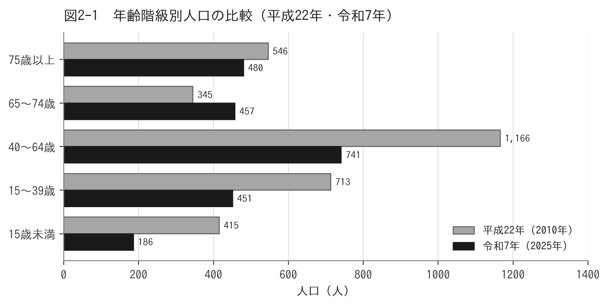

**図2-1　年齢階級別人口の比較（平成22年・令和7年）**

出典：総務省「国勢調査」、国立社会保障・人口問題研究所「日本の地域別将来推計人口」

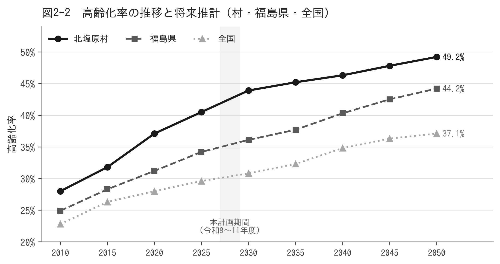

**図2-2　高齢化率の推移と将来推計（村・福島県・全国）**

出典：地域包括ケア「見える化」システム

本村の総人口は、平成22年（2010年）の3,185人から令和7年（2025年）の2,315人へと、15年間で870人（27.3%）減少しました。高齢化率は同期間に28.0%から40.5%へと12.5ポイント上昇しています。

本村は磐梯山の北麓に位置し、北山・大塩・桧原・裏磐梯の4地区に集落が分散しています。積雪の多い中山間地域であり、地区により生活環境や交通条件が異なります。第9期のアンケート調査は全設問を地区別に集計しており、本計画でも地区ごとの状況を踏まえて施策を組み立てます。

| 年 | 総人口 | 15歳未満 | 生産年齢人口 | 65〜74歳 | 75歳以上 | 高齢化率 |
|---|---|---|---|---|---|---|
| 平成22年 | 3,185 | 415 | 1,879 | 345 | 546 | 28.0% |
| 平成27年 | 2,831 | 324 | 1,608 | 399 | 500 | 31.8% |
| 令和2年 | 2,556 | 258 | 1,349 | 507 | 441 | 37.1% |
| 令和7年 | 2,315 | 186 | 1,192 | 457 | 480 | 40.5% |

出典：総務省「国勢調査」（令和2年まで）、国立社会保障・人口問題研究所「日本の地域別将来推計人口」（令和7年）　単位：人

### 県内・全国との比較

本村の高齢化率40.5%は、福島県平均34.2%を6.3ポイント、全国平均29.6%を10.9ポイント上回ります。ただし県内における位置は46保険者中22番目、全国では1,558保険者中538番目であり、県内ではおおむね中位に位置します。

| 年 | 北塩原村 | 福島県 | 全国 | 県との差 |
|---|---|---|---|---|
| 平成22年 | 28.0% | 24.9% | 22.8% | +3.1 |
| 令和2年 | 37.1% | 31.2% | 28.0% | +5.9 |
| 令和7年 | 40.5% | 34.2% | 29.6% | +6.3 |
| 令和12年 | 43.9% | 36.1% | 30.8% | +7.8 |
| 令和22年 | 46.3% | 40.3% | 34.8% | +6.0 |

県との差は令和12年の7.8ポイントが最大となり、その後は縮小に向かいます。本計画の期間は、県との差が最も大きくなる時期にあたります。

## 2-2　将来人口の見通し

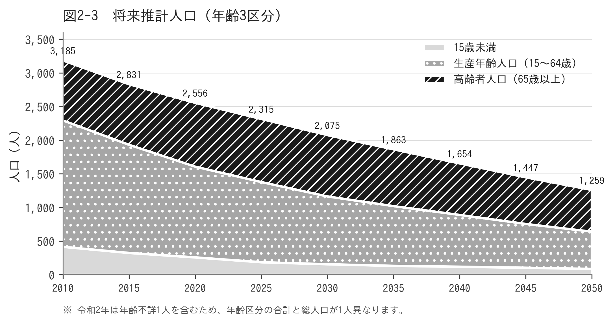

**図2-3　将来推計人口（年齢3区分）**

出典：国立社会保障・人口問題研究所「日本の地域別将来推計人口」

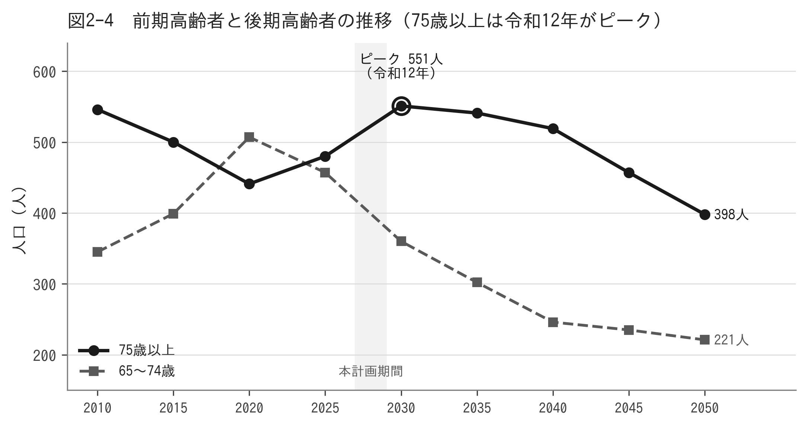

**図2-4　前期高齢者と後期高齢者の推移**

出典：国立社会保障・人口問題研究所「日本の地域別将来推計人口」

福島県では、国立社会保障・人口問題研究所による市町村別の将来推計人口が公表されていません。このため厚生労働省は、住民基本台帳を基礎とした推計人口を県内の保険者へ配布しています。本計画の将来推計は、令和8年8月に配布されたこのデータを用います。

本村の高齢者人口はすでに減少局面に入っています。一方で、75歳以上の後期高齢者は令和12年（2030年）まで増加を続けます。本計画の期間（令和9年度から令和11年度まで）は、その増加のまっただ中にあたります。

### 第1号被保険者数の推計

将来推計人口を第1号被保険者数として用いる場合、人口と被保険者数には定義上の差があることに留意する必要があります。厚生労働省は、令和8年1月1日の住民基本台帳人口と令和7年12月末の第1号被保険者数が一致するよう、保険者ごとの補正係数を算出して配布しています。本村の係数は前期高齢者0.00412、後期高齢者0.01901です。

> ⚙ **編集注記**：国は、小規模な保険者では3区分（65〜74歳・75〜84歳・85歳以上）の補正係数が被保険者1人の増減で大きく動くため、前期・後期高齢者別の係数を選択することも検討するよう求めています。本村の85歳以上は約200人であることから、前期・後期高齢者別の係数を用います。

|  | 前期高齢者 | 後期高齢者 | 第1号被保険者計 | 後期高齢者の割合 |
|---|---|---|---|---|
| 令和7年（実績） | 486 | 526 | 1,012 | 52.0% |
| 令和9年 | 465 | 538 | 1,003 | 53.6% |
| 令和10年 | 444 | 551 | 995 | 55.4% |
| 令和11年 | 424 | 563 | 987 | 57.0% |
| 令和12年 | 406 | 565 | 971 | 58.2% |

出典：厚生労働省配布「第10期将来推計用推計人口」を基礎に作成　単位：人

第1号被保険者数は令和9年の1,003人から令和11年の987人へと16人（1.6%）減少します。一方で後期高齢者の割合は53.6%から57.0%へと3.4ポイント上昇します。人数は減るものの、支援を必要とする方の割合が高い層が増える構造です。

> ⚙ **編集注記**：配布データの推計値をそのまま用いると、令和8年の第1号被保険者数は954人となり、実績の1,012人を58人（5.7%）下回ります。第9期計画で生じた乖離（6.6%）とほぼ同じ規模です。本計画では、配布データの伸び率を用いつつ、水準を令和8年の実績に合わせる方法を採ることとして上表を作成しています。この方法の採否は策定委員会にお諮りします。

## 2-3　要支援・要介護認定の状況

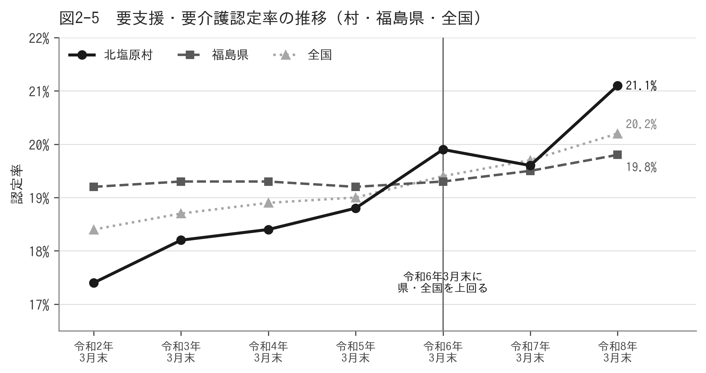

**図2-5　要支援・要介護認定率の推移（村・福島県・全国）**

出典：地域包括ケア「見える化」システム

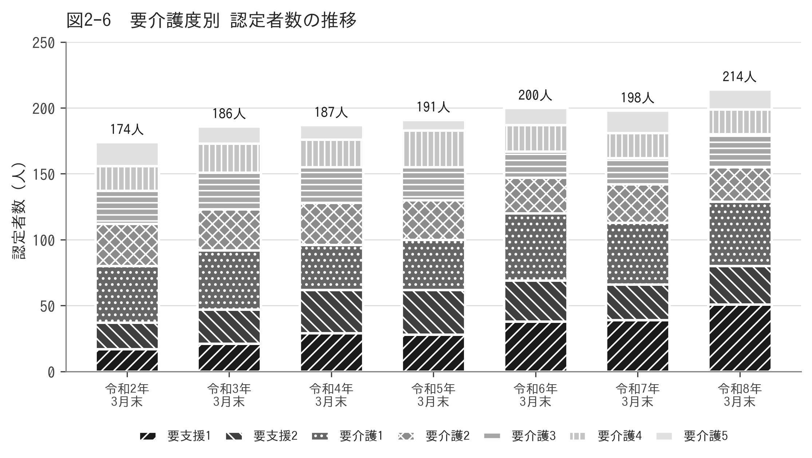

**図2-6　要介護度別 認定者数の推移**

出典：厚生労働省「介護保険事業状況報告」

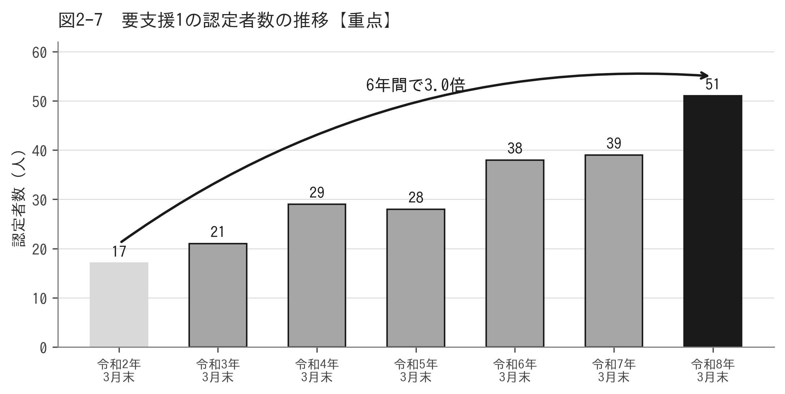

**図2-7　要支援1の認定者数の推移**

出典：厚生労働省「介護保険事業状況報告」

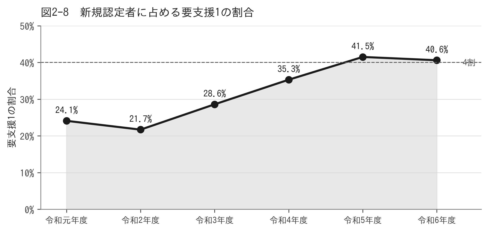

**図2-8　新規認定者に占める要支援1の割合**

出典：地域包括ケア「見える化」システム

令和8年3月末時点の要支援・要介護認定者は214人、認定率は21.1%です。認定率は令和2年3月末の17.4%から3.7ポイント上昇しました。

### 県内・全国との比較

本村の認定率は、令和2年3月末には福島県平均を1.8ポイント下回っていましたが、令和6年3月末に県平均・全国平均をともに上回りました。以後その差は拡大しています。

| 時点 | 北塩原村 | 福島県 | 全国 |
|---|---|---|---|
| 令和2年3月末 | 17.4% | 19.2% | 18.4% |
| 令和4年3月末 | 18.4% | 19.3% | 18.9% |
| 令和6年3月末 | 19.9% | 19.3% | 19.4% |
| 令和8年3月末 | 21.1% | 19.8% | 20.2% |

令和2年3月末から令和8年3月末までの6年間の上昇幅は、本村が3.7ポイントであるのに対し、福島県は0.6ポイント、全国は1.8ポイントです。本村の上昇は県平均の約6倍の速さで進んでいます。認定率の順位は県内59保険者中18番目、全国1,574保険者中442番目です。

### 要介護度別の状況

認定率の上昇は、主として要支援1の増加によるものです。要支援1の認定者は令和2年3月末の17人から令和8年3月末の51人へと6年間で3倍になりました。

| 時点 | 要支援1 | 要支援2 | 要介護1 | 要介護2 | 要介護3 | 要介護4 | 要介護5 | 合計 |
|---|---|---|---|---|---|---|---|---|
| 令和2年3月末 | 17 | 20 | 43 | 32 | 25 | 19 | 18 | 174 |
| 令和4年3月末 | 29 | 33 | 34 | 32 | 27 | 21 | 11 | 187 |
| 令和6年3月末 | 38 | 31 | 51 | 27 | 20 | 20 | 13 | 200 |
| 令和8年3月末 | 51 | 29 | 49 | 26 | 25 | 19 | 15 | 214 |

新たに認定を受けた方に占める要支援1の割合も、令和5年度41.5%、令和6年度40.6%と4割を超えています。

### 年齢階級別の認定率

| 区分 | 第1号被保険者数 | 認定者数 | 認定率 |
|---|---|---|---|
| 前期高齢者（65〜74歳） | 493人 | 32人 | 6.5% |
| 後期高齢者（75歳以上） | 522人 | 182人 | 34.9% |
| （うち85歳以上） | 202人 | 125人 | 61.9% |
| 合計 | 1,015人 | 214人 | 21.1% |

後期高齢者の認定率は前期高齢者の5.4倍です。2-2で述べたとおり後期高齢者の割合が高まるため、第1号被保険者数が減少しても、認定者数は増加していく見通しです。

## 2-4　介護サービスの利用状況

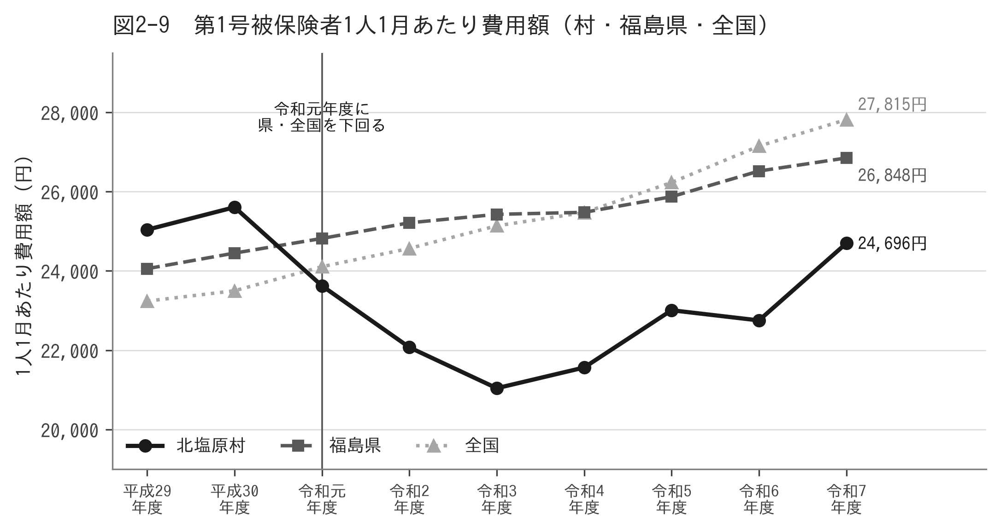

**図2-9　第1号被保険者1人1月あたり費用額（村・福島県・全国）**

出典：地域包括ケア「見える化」システム

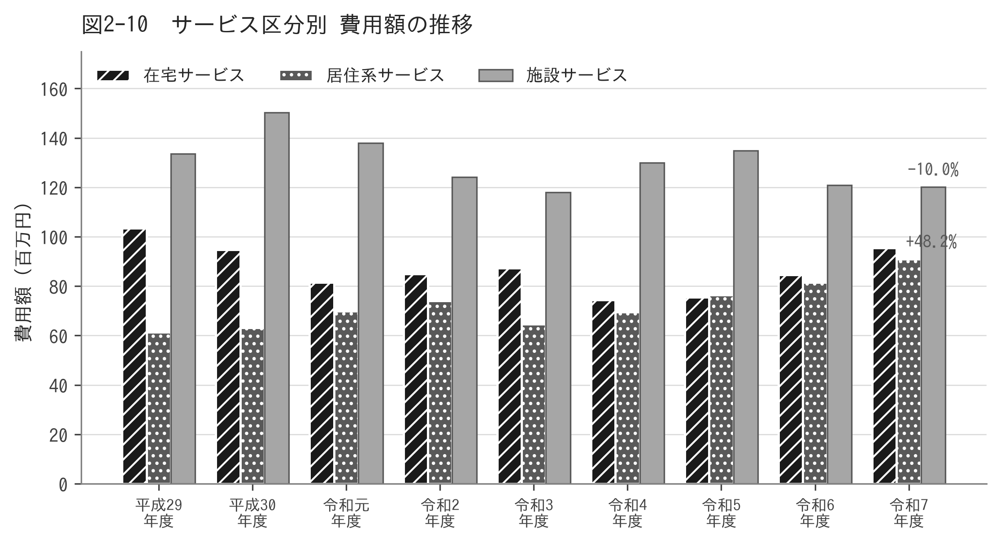

**図2-10　サービス区分別 費用額の推移**

出典：地域包括ケア「見える化」システム

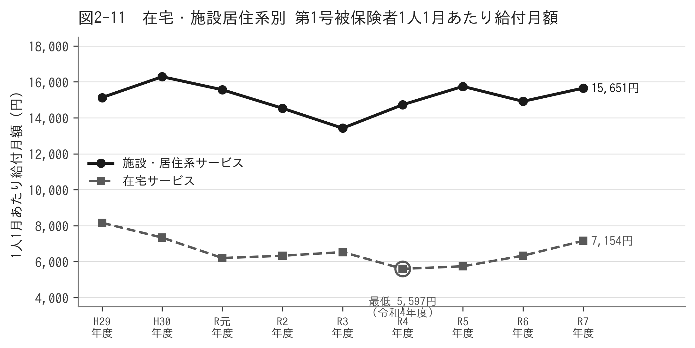

**図2-11　在宅・施設居住系別 第1号被保険者1人1月あたり給付月額**

出典：地域包括ケア「見える化」システム

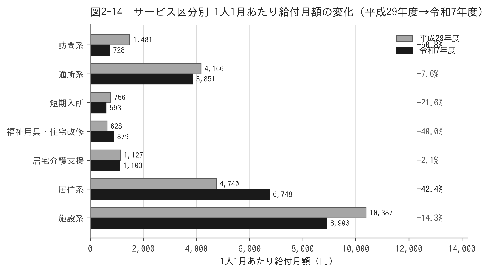

**図2-14　サービス区分別 1人1月あたり給付月額の変化（平成29年度→令和7年度）**

出典：地域包括ケア「見える化」システム

第1号被保険者1人1月あたりの費用額は、令和7年度で24,696円です。平成30年度までは福島県平均・全国平均を上回っていましたが、令和元年度に逆転し、以後一度も上回っていません。

| 年度 | 北塩原村 | 福島県 | 全国 | 県との差 |
|---|---|---|---|---|
| 平成29年度 | 25,039 | 24,056 | 23,238 | +983 |
| 平成30年度 | 25,606 | 24,449 | 23,499 | +1,157 |
| 令和元年度 | 23,624 | 24,819 | 24,106 | ▲1,195 |
| 令和3年度 | 21,041 | 25,426 | 25,137 | ▲4,384 |
| 令和5年度 | 23,008 | 25,871 | 26,229 | ▲2,863 |
| 令和7年度 | 24,696 | 26,848 | 27,815 | ▲2,152 |

単位：円　1人1月あたりの費用額の順位は県内59保険者中44番目、全国1,574保険者中1,153番目です。

### サービス区分別の状況

| 年度 | 在宅サービス | 居住系サービス | 施設サービス | 合計 |
|---|---|---|---|---|
| 平成29年度 | 103,507 | 61,367 | 133,638 | 298,511 |
| 令和3年度 | 87,302 | 64,586 | 117,995 | 269,884 |
| 令和5年度 | 75,511 | 76,362 | 134,845 | 286,719 |
| 令和7年度 | 95,383 | 90,952 | 120,232 | 306,567 |

単位：千円　在宅サービスは平成29年度から令和4年度にかけて28.1%減少した後、回復に転じています。居住系サービスは一貫して増加し、平成29年度から令和7年度で48.2%増加しました。施設サービスは10.0%減少しています。

### ★サービス区分別に見た変化

第1号被保険者1人1月あたりの給付月額を、サービスの区分ごとに平成29年度と令和7年度で比較しました。

| 区分 | 平成29年度 | 令和7年度 | 増減 | 増減率 | 令和7年度の構成比 |
|---|---|---|---|---|---|
| 訪問系 | 1,481 | 728 | ▲753 | ▲50.8% | 3.2% |
| 通所系 | 4,166 | 3,851 | ▲315 | ▲7.6% | 16.9% |
| 短期入所 | 756 | 593 | ▲163 | ▲21.6% | 2.6% |
| 福祉用具・住宅改修 | 628 | 879 | +251 | +40.0% | 3.9% |
| 居宅介護支援 | 1,127 | 1,103 | ▲24 | ▲2.1% | 4.8% |
| 居住系 | 4,740 | 6,748 | +2,008 | +42.4% | 29.6% |
| 施設系 | 10,387 | 8,903 | ▲1,484 | ▲14.3% | 39.0% |
| 合計 | 23,285 | 22,805 | ▲480 | ▲2.1% | 100.0% |

単位：円　全体では2.1%の減少にとどまりますが、区分ごとの動きは大きく異なります。

**もっとも大きく減っているのは訪問系サービスで、9年間で50.8%減少しました。**訪問介護は1,143円から308円へと73.1%減、訪問入浴介護は178円から5円へと97.2%減となっています。令和7年度において、訪問系サービスが給付全体に占める割合はわずか3.2%です。

一方で増えているのは居住系サービス（+42.4%）で、その中心は認知症対応型共同生活介護です。同サービス単独で給付全体の27.5%を占めています。福祉用具・住宅改修も40.0%増加しました。

在宅生活を支える中核である訪問系サービスが半減し、給付の約7割を居住系・施設系が占める構造になっています。2-5で述べるサービス供給体制の状況とあわせて読む必要があります。

## 2-5　サービス供給体制の状況

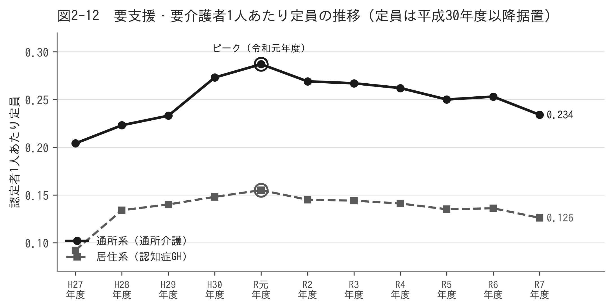

**図2-12　要支援・要介護者1人あたり定員の推移**

出典：地域包括ケア「見える化」システム

村内で提供されている介護サービスは、認知症対応型共同生活介護（定員27人）と通所介護（定員50人）の2種類です。介護老人福祉施設、介護老人保健施設、介護医療院といった施設サービスは村内になく、必要とする方は村外の施設を利用しています。

| 年度 | 居住系定員（認知症GH） | 通所系定員（通所介護） | 1人あたり定員（居住系） | 1人あたり定員（通所系） |
|---|---|---|---|---|
| 平成27年度 | 18 | 40 | 0.092 | 0.204 |
| 平成30年度 | 27 | 50 | 0.148 | 0.273 |
| 令和元年度 | 27 | 50 | 0.155 | 0.287 |
| 令和5年度 | 27 | 50 | 0.135 | 0.250 |
| 令和7年度 | 27 | 50 | 0.126 | 0.234 |

定員は平成30年度以降変わっていません。一方で要支援・要介護認定者が増加したため、認定者1人あたりの定員は令和元年度をピークに低下しており、令和7年度は定員が現在の水準となった平成30年度以降で最も低い値です。実質的な供給力は目減りしています。

### 村外サービスの利用状況

村内にサービスがないため、多くのサービスを村外で利用しています。第1号被保険者1人1月あたりの給付月額を平成29年度と令和7年度で比較すると、次のとおりです。

| サービス | 平成29年度 | 令和7年度 | 増減率 |
|---|---|---|---|
| 認知症対応型共同生活介護 | 4,551円 | 6,266円 | +37.7% |
| 介護老人福祉施設（特別養護老人ホーム） | 3,576円 | 3,759円 | +5.1% |
| 介護老人保健施設 | 5,666円 | 4,856円 | ▲14.3% |
| 通所介護 | 3,255円 | 3,409円 | +4.7% |
| 訪問介護 | 1,143円 | 308円 | ▲73.1% |
| 介護療養型医療施設 | 1,145円 | 0円 | 廃止 |
| 介護医療院 | 0円 | 288円 | 新設 |

> ⚙ **編集注記**：介護療養型医療施設は令和5年度末に廃止され、介護医療院へ移行しました。ただし本村では介護療養型医療施設が平成29年度に1,145円であったのに対し、介護医療院は令和7年度で288円にとどまっており、単純な移行にはなっていません。この差の要因は、令和6年度決算等の確認とあわせて整理します。

> ⚙ **編集注記**：短期入所生活介護について、令和5年度（205円）から令和7年度（543円）にかけて165%増加していますが、同サービスの給付月額は年により大きく変動しており（平成27年度716円、令和4年度249円等）、2年間の比較では傾向を判断できません。平成29年度（525円）と令和7年度（543円）の比較では+3.4%であり、長期的にはほぼ横ばいです。家族介護者の負担については、在宅介護実態調査により改めて把握します。

## 2-6　地域支援事業・介護予防の状況

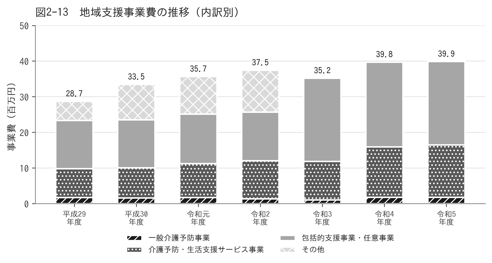

**図2-13　地域支援事業費の推移（内訳別）**

出典：介護保険特別会計決算

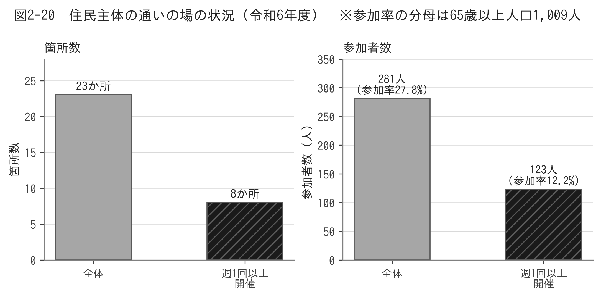

**図2-20　住民主体の通いの場の状況（令和6年度）**

出典：厚生労働省「介護予防・日常生活支援総合事業（地域支援事業）の実施状況に関する調査」

介護予防・日常生活支援総合事業のうち、訪問型サービスA・B・C・D、通所型サービスA・B・C、見守り、配食といった多様な主体によるサービスは、いずれも実施実績がありません。従前相当サービス以外の事業費が総合事業に占める割合は0.0%です。

地域支援事業費は平成26年度の15,580千円から令和5年度の39,886千円へと2.56倍に増加しました。ただし内訳を見ると、増加しているのは包括的支援事業・任意事業（3.73倍）であり、一般介護予防事業費は10年近く180万円前後で推移しています。

| 年度 | 一般介護予防事業 | 介護予防・生活支援サービス事業 | 包括的支援事業・任意事業 | 合計 |
|---|---|---|---|---|
| 平成29年度 | 1,707 | 8,120 | 13,504 | 28,727 |
| 令和2年度 | 1,767 | 9,483 | 13,886 | 35,671 |
| 令和5年度 | 1,825 | 14,637 | 23,423 | 39,886 |

単位：千円　※平成29年度の合計にはその他の事業費を含みます。

一般介護予防事業としては、はつらつリハビリ教室、シニア元気アップ教室、住民主体の通いの場であるいきいき百歳体操などを実施しています。令和6年度の実施状況は、通いの場が23か所・参加者281人で、参加率は12.2%です。このうち週1回以上開催しているのは8か所・123人で、参加率は5.3%にとどまります。

第9期のアンケート調査における参加率11.2%（509人中57人）とほぼ同じ水準であり、地区による差が大きいことも確認されています。とりわけ大塩地区は参加率・参加意向がいずれも最も低い状況です。

介護予防の効果は開催の頻度に左右されます。週1回以上の開催が8か所にとどまることは、箇所数を増やすことと同時に、既存の通いの場の開催頻度を高めることが課題であることを示しています。

> ⚙ **編集注記**：地域包括ケア「見える化」システムの通いの場のデータは令和2年度で更新を終えているため、上記は令和6年度の介護予防・日常生活支援総合事業の実施状況に関する調査による数値です。

### 地域包括支援センター

地域包括支援センターは村内に1か所、委託により運営しています。職員体制は保健師（準ずる者を含む）、社会福祉士、主任介護支援専門員の3職種各1名の計3名です。主任介護支援専門員は令和4年度から配置されました。

地域ケア会議は、地域ケア個別会議を年3回、地域ケア推進会議を年3回の計6回開催しています。

## 2-7　介護保険財政の状況

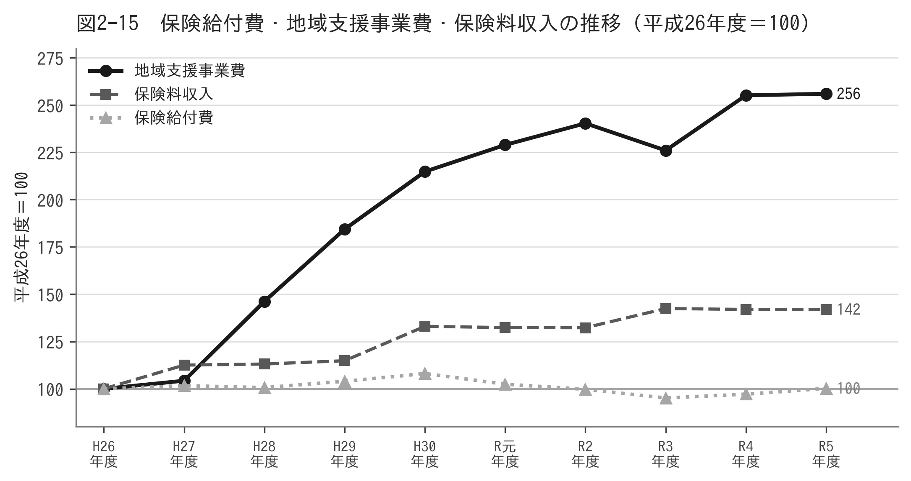

**図2-15　保険給付費・地域支援事業費・保険料収入の推移**

出典：介護保険特別会計決算

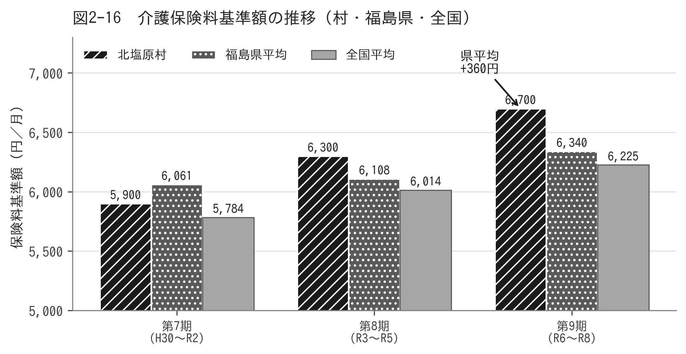

**図2-16　介護保険料基準額の推移（村・福島県・全国）**

出典：地域包括ケア「見える化」システム

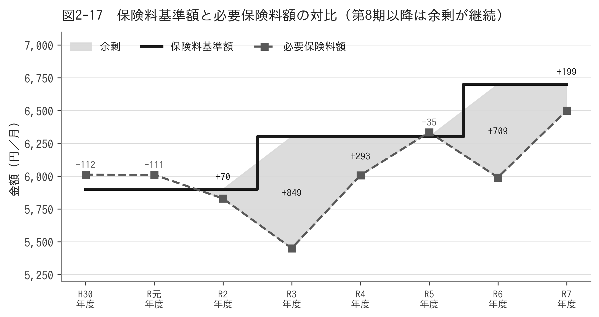

**図2-17　保険料基準額と必要保険料額の対比**

出典：地域包括ケア「見える化」システム

介護保険特別会計の決算を平成26年度と令和5年度で比較すると、次のような特徴が見られます。

| 項目 | 平成26年度 | 令和5年度 | 倍率 |
|---|---|---|---|
| 歳入合計 | 306,763 | 355,830 | 1.16倍 |
| 歳出合計 | 304,720 | 350,039 | 1.15倍 |
| 保険給付費 | 279,774 | 280,366 | 1.00倍 |
| 地域支援事業費 | 15,580 | 39,886 | 2.56倍 |
| 保険料収入 | 48,998 | 69,539 | 1.42倍 |
| うち調整交付金 | 23,463 | 15,659 | 0.67倍 |

単位：千円　保険給付費は10年間ほぼ横ばいであるにもかかわらず、保険料収入は1.42倍になっています。増加しているのは地域支援事業費であり、また国からの調整交付金が3分の2に減少したことにより、村の負担が相対的に大きくなっています。

### 介護保険料

|  | 第7期 | 第8期 | 第9期 |
|---|---|---|---|
| 北塩原村 | 5,900円 | 6,300円 | 6,700円 |
| 福島県平均 | 6,061円 | 6,108円 | 6,340円 |
| 全国平均 | 5,784円 | 6,014円 | 6,225円 |

本村の保険料基準額は、第7期には県平均を下回っていましたが、第8期に上回り、第9期では県平均を360円、全国平均を475円上回っています。一方で2-4のとおり1人あたりの費用額は県内59保険者中44番目と低い水準にあります。この状況については、第5章で改めて整理します。

> ⚙ **編集注記**：介護給付費準備基金の残高の推移は、村から令和6年度末実績・令和7年度末見込の提供を受けたうえで記載します。

## 2-8　保険者機能の評価

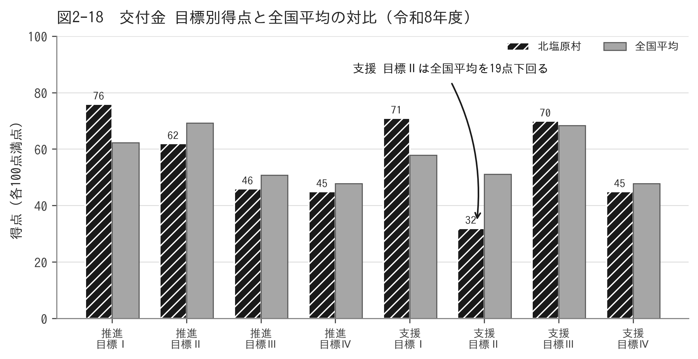

**図2-18　交付金 目標別得点と全国平均の対比（令和8年度）**

出典：厚生労働省「令和8年度評価指標に係る該当状況調査票集計表」

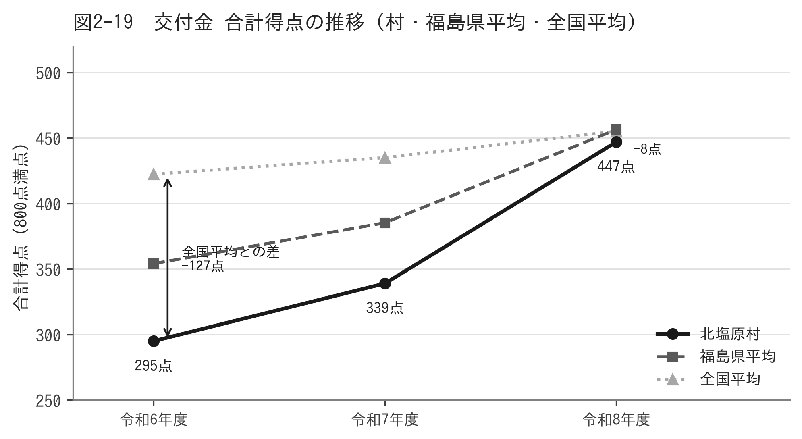

**図2-19　交付金 合計得点の推移（村・福島県平均・全国平均）**

出典：厚生労働省「評価指標に係る該当状況調査票集計表」（令和6〜8年度）

国は、保険者機能強化推進交付金および介護保険保険者努力支援交付金の評価指標により、市町村の取組を毎年度評価しています。両交付金の合計は800点満点です。

|  | 令和6年度 | 令和7年度 | 令和8年度 |
|---|---|---|---|
| 保険者機能強化推進交付金（400点） | 124 | 155 | 229 |
| 介護保険保険者努力支援交付金（400点） | 171 | 184 | 218 |
| 合計（800点） | 295 | 339 | 447 |
| 全国平均 | 422.4 | 435.0 | 455.1 |
| 福島県平均（59市町村） | 354.1 | 385.3 | 456.4 |
| 全国順位（1,741市町村中） | 1,564位 | 1,462位 | 1,005位 |
| 県内順位（59市町村中） | 44位 | 40位 | 34位 |

3年間で152点（51.5%）増加しました。全国平均の伸びが32.8点であることと比べても大きな伸びです。令和6年度は全国平均を127点下回っていましたが、令和8年度には8.1点差まで縮まりました。全国順位は1,564位から1,005位へ、県内順位は44位から34位へと上がっています。第9期の計画期間を通じて保険者としての取組が積み上がったことが、数値で確認できます。

### 残された課題は2点です

| 区分 | 本村 | 全国平均 | 内容 |
|---|---|---|---|
| 介護保険保険者努力支援交付金 目標Ⅱ（認知症総合支援） | 32点 | 51.1点 | 全国平均を下回る唯一の目標。3か年で唯一、得点が低下した局面がある |
| 目標Ⅳ（成果指標群） | 45点 | 47.8点 | 令和6年度65点、令和7年度70点から令和8年度は45点へ25点低下 |

目標Ⅳは、村の申告ではなく国が保有する統計から自動的に算定される領域です。得点の低下は、要介護度の維持・改善の実績そのものが後退したことを意味します。両交付金の合計で50点の減となっており、令和8年度の伸びを打ち消しています。

### 全国の多くの市町村が取得している項目のうち、未取得のもの

令和8年度の評価で本村が0点であり、かつ全国の45%以上の市町村が取得している項目は32項目・配点合計122点でした。主なものは次のとおりです。

| 交付金・目標 | 評価指標 | 配点 | 全国該当率 |
|---|---|---|---|
| 推進・目標Ⅱ | 給付費適正化事業の取組状況（主要3事業の全実施） | 6 | 96.9% |
| 支援・目標Ⅲ | 在宅医療・介護連携に関する課題・対応策の検討 | 5 | 72.3% |
| 支援・目標Ⅱ | 認知症サポーター等を活用した地域支援体制の構築 | 4 | 78.1% |
| 支援・目標Ⅱ | 早期診断・早期対応の体制構築 | 5 | 74.4% |
| 支援・目標Ⅱ | 難聴高齢者の早期発見・早期介入 | 5 | 68.9% |
| 支援・目標Ⅲ | 人生の最終段階における支援の実施状況 | 8 | 50.0〜70.0% |

### 成果指標（アウトカム）の状況

| 指標 | 令和5年度 | 評価 |
|---|---|---|
| 短期平均要介護度の伸び（軽度） | +33.17% | 重度化が進行 |
| 同（前年度の変化率との差） | +7.52% | 前年よりさらに悪化 |
| 短期平均要介護度の伸び（中重度） | ▲5.03% | 改善 |
| 性・年齢調整済み要介護2以上認定率 | 8.65% | ― |

中重度の方については状態の改善が見られる一方、軽度の方については重度化が進んでいます。2-3で見た要支援1の急増と、2-6で見た介護予防の受け皿の不足が、この結果に現れているものと考えられます。

> ⚙ **編集注記**：評価指標は毎年度改定されるため、得点の推移は参考値です。ただし令和6年度から令和8年度までは800点満点・目標別各100点・指標群別の配点がいずれも同一であり、枠組みは変わっていません。なお令和5年度以前は評価指標の体系そのものが異なるため、令和6年度以降の得点とは接続しません。

## 2-9　第9期計画の進捗と評価

第9期計画に掲げた数値と実績を比較し、乖離の状況とその要因を検証しました。

### 第1号被保険者数

|  | 計画値 | 実績 | 差 |
|---|---|---|---|
| 令和6年度 | 957人 | 1,011人 | +54人 |
| 令和7年度 | 950人 | 1,015人 | +65人 |
| 令和8年度 | 942人 | 約1,009人（推計） | +67人 |

第9期計画は将来推計人口をそのまま用いたため、実績を6.6%下回る見込みとなりました。第1号被保険者数は保険料算定の基礎となるため、この乖離は保険料の水準にも影響しています。

### 要支援・要介護認定者数（令和7年）

| 区分 | 計画値 | 実績 | 差 |
|---|---|---|---|
| 要支援1 | 33人 | 約45人 | +36% |
| 要支援2 | 32人 | 約28人 | ▲13% |
| 要介護1 | 45人 | 約48人 | +7% |
| 要介護4 | 31人 | 約19人 | ▲39% |
| 合計 | 200人 | 約206人 | +3% |

合計ではおおむね計画どおりですが、要介護度別に見ると要支援1が36%多く、要介護4が39%少ない結果となりました。合計では両者の差が相殺されるため、要介護度別に検証しなければ乖離を把握できません。

### 介護給付費

| 年度 | 計画値 | 決算額 | 差 |
|---|---|---|---|
| 令和3年度 | 266,187 | 266,191 | +4 |
| 令和4年度 | 271,862 | 271,863 | +1 |
| 令和5年度 | 276,446 | 280,366 | +3,920 |

単位：千円　令和5年度は見込みを1.4%上回りました。

> ⚙ **編集注記**：令和6年度決算および令和7年度の給付費見込の提供を受けたうえで、第9期全体の乖離を確定します。

### 検証から得られた課題

第9期の乖離は、いずれも推計の手法と、推計値と実績を突き合わせる仕組みがなかったことに帰着します。国の評価指標においても「計画値と実績値の乖離状況の分析」は令和3年度から令和5年度まで0点が続いており、本計画ではこの点を第6章において改善します。

## 2-10　アンケート調査結果

> ⚙ **編集注記**：本節には、令和8年度に実施する介護予防・日常生活圏域ニーズ調査および在宅介護実態調査の結果を記載します。リスク判定11種の結果および第8期・第9期調査との時系列比較を含めます。以下は、比較の基礎となる第9期調査（令和5年度実施）の主な結果です。

### 参考：第9期調査の実施状況

| 調査 | 対象者数 | 回収数 | 有効回収率 |
|---|---|---|---|
| 介護予防・日常生活圏域ニーズ調査 | 883人 | 509人 | 57.6% |
| 在宅介護実態調査 | 72人 | 33人 | 45.8% |

### 参考：第9期調査の主な結果

| 項目 | 結果 | 備考 |
|---|---|---|
| 今後必要と感じる支援　第1位 | 除雪 27.5% | 509人中約140人。在宅介護実態調査でも24.2% |
| 同　第2位以下 | 移送サービス10.8%、地域・近所の見守り、声かけ、外出同行10.4% | ― |
| 介護予防のための通いの場への参加 | 11.2% | 地区差が大きい。大塩地区が最も低い |
| 認知症の相談窓口を知っている | 31.2% | 前回36.7%から低下。裏磐梯地区は20.6% |
| 成年後見制度を「わからない」 | 30.3% | 判断能力低下に備えた家族との話し合いは27.7% |
| 人生の最期を過ごしたい場所「自宅」 | 48.5% | 家族と話したことがある38.3% |
| 村内に施設等があれば将来的に入所したい | 48.5% | 在宅介護実態調査。回収33人中16人 |

> ⚙ **編集注記**：「村内に施設等があれば将来的に入所したい」48.5%は、回収33件中16人の回答です。標本が小さいため、この数値のみを施設整備の判断根拠とすることは避け、2-5で示した供給体制の状況とあわせて読む必要があります。第10期の在宅介護実態調査は対象を約150人に拡大しており、改めて確認します。

## 2-11　本村の課題

これまでの分析から、本村の課題は次の5点に整理されます。

### 課題1　認定を受けても、利用できるサービスが限られています

認定率は県内59保険者中18番目と高い水準にある一方、1人あたりの費用額は44番目と低い水準にあります。村内には施設サービスがなく、居住系・通所系の定員も平成30年度以降変わっていません。認定者が増えるなかで定員が据え置かれているため、実質的な供給力は低下しています。

第9期の在宅介護実態調査では「村内に施設等があれば将来的に入所したい」との回答が48.5%（回収33人中16人）ありました。標本は小さいものの、供給側のデータと方向が一致しています。

### 課題2　軽度の方が急増し、その受け皿が整っていません

要支援1の認定者は6年間で3倍になりました。しかし総合事業における多様なサービスは実施されておらず、受け皿は従前相当のサービスに限られています。国の評価指標においても、軽度の方の重度化が進んでいることが確認されています。

### 課題3　計画を評価し改善する仕組みが十分ではありません

計画値と実績値の乖離の分析、目標未達成時の改善、評価結果の共有のいずれもが、国の評価指標において0点となっています。第9期の推計の乖離も、検証の仕組みがあれば計画期間の途中で把握できたものです。

### 課題4　保険料と給付水準の関係を説明する必要があります

保険給付費が10年間ほぼ横ばいであるにもかかわらず保険料は上昇し、県平均・全国平均を上回っています。一方で1人あたりの費用額は県内で低い水準にあります。この関係を村民の皆様に分かりやすく説明することが求められます。

### 課題5　人口構造の転換に備える必要があります

高齢者の総数は減少局面に入りましたが、75歳以上は令和12年まで増加します。認定率は前期高齢者の6.5%に対し後期高齢者は34.9%であり、高齢者総数が減っても認定者は増えていきます。同時に生産年齢人口は5年間で15.4%減少します。

### 課題6　冬期の生活と移動を支える必要があります

第9期のアンケート調査で、今後必要と感じる支援の第1位は「除雪」27.5%（509人中約140人）でした。在宅介護実態調査でも24.2%と、要介護認定を受けている方でも同様の傾向です。第2位以下も移送サービス10.8%、地域・近所の見守り、声かけ、外出同行10.4%と、積雪と地理的条件に根差した生活支援のニーズが明確に表れています。

第9期計画では、除雪は「在宅生活の継続支援」の一部として扱われており、独立した施策としては位置づけられていませんでした。住民が最も必要と感じている支援である以上、本計画では正面から扱います。

---

# 第3章　計画の基本的な考え方

## 3-1　基本理念

本計画は、第9期計画の基本理念を継承します。

### 「結」のこころを持って支え合う地域共生社会

### 自分らしくあなたらしく　笑顔で暮らし輝き続ける　北塩原村

「結」は、農作業や屋根の葺き替えなど、集落の人々が力を合わせて助け合う本村に古くから伝わる仕組みです。支え手が減っていくこれからの時代にあって、行政の支援だけでなく、村民一人ひとりが自らの健康を保ち、互いに支え合う関係を築いていくことが、これまで以上に重要になります。

> ⚙ **編集注記**：基本理念の継承については村と協議のうえ確定します。

## 3-2　基本目標

基本理念の実現に向けて、5つの基本目標を掲げます。第9期の4つの基本目標を継承したうえで、計画の実効性を高めるため、基本目標5を新たに設けます。

|  | 基本目標 | ねらい |
|---|---|---|
| 1 | 健康づくりと介護予防施策の充実・推進 | 軽度の方の重度化を防ぎ、健康な期間を延ばします |
| 2 | 安心で自分らしい生活支援の充実 | 住み慣れた地域で暮らし続けられるよう支えます |
| 3 | 質の高い介護サービスの充実 | 必要なサービスを必要な方に届けます |
| 4 | 地域で支えあう仕組みづくり | 関係機関と地域が連携する体制をつくります |
| 5 | 計画の推進と進捗管理【新設】 | 計画を評価し改善する仕組みを確立します |

基本目標5は、第9期計画の検証（2-9）を踏まえて新たに設けるものです。計画を立てるだけでなく、毎年度その進捗を確認し、必要な見直しを行う仕組みを、計画そのものに位置づけます。

## 3-3　第10期の重点

2-11で整理した6つの課題を踏まえ、本計画では次の4点を重点として取り組みます。

### 重点1　軽度の方の重度化を防ぎます

要支援1の認定者が6年間で3倍になり、軽度の方の重度化が進んでいます。総合事業における多様なサービスの創設を検討するとともに、通いの場を再構築し、一般介護予防事業を拡充します。（課題2に対応）

### 重点2　後期高齢者の増加に備えます

高齢者の総数は減少しますが、75歳以上は令和12年まで増加します。認定者が増えることを前提に、サービスの供給体制と支え手の確保を進めます。国の基本指針が示す「中山間・人口減少地域」の類型に即し、人材確保と地域の実情に応じた提供体制を整理します。（課題1・課題5に対応）

### 重点3　冬期の生活と移動を支えます

住民が最も必要と感じている支援は「除雪」です。公的サービスと住民互助の役割分担を整理し、移動・外出支援とあわせて、積雪地・中山間地域の生活を支える仕組みを組み立てます。（課題6に対応）

### 重点4　計画を評価し改善する仕組みをつくります

すべての施策に成果目標・活動指標を設定し、毎年度その達成状況を確認します。計画値と実績値の乖離を検証し、策定委員会に報告します。（課題3・課題4に対応）

## 3-4　施策の体系

| 基本目標 | 施策 |
|---|---|
| 1 健康づくりと介護予防施策の充実・推進 | 1-1 通いの場の再構築と参加率の向上／1-2 総合事業における多様なサービスの創設／1-3 一般介護予防事業の拡充／1-4 介護予防におけるデータ活用／1-5 地域リハビリテーション活動支援事業の推進／1-6 高齢者の保健事業と介護予防の一体的実施 |
| 2 安心で自分らしい生活支援の充実 | 2-1 高齢者の移動に関する支援／2-2 社会参加の促進とインセンティブの検討／2-3 住まいの安定的な確保と生活困難者支援／2-4 日常生活の安全確保／2-5 地域支え合い活動の促進／2-6 冬期の生活支援（除雪）【新規】 |
| 3 質の高い介護サービスの充実 | 3-1 居宅サービスの確保／3-2 地域密着型サービスの維持と定員の検討／3-3 村外施設サービスの利用支援／3-4 短期入所サービスの確保／3-5 介護給付の適正化 |
| 4 地域で支えあう仕組みづくり | 4-1 地域包括支援センターの機能強化／4-2 地域ケア会議の充実／4-3 在宅医療・介護連携の推進／4-4 認知症施策の推進／4-5 生活支援体制の整備／4-6 介護人材の確保と生産性向上／4-7 成年後見制度の利用促進 |
| 5 計画の推進と進捗管理 | 5-1 成果目標・活動指標の設定と毎年度の進捗評価／5-2 計画値と実績値の乖離分析／5-3 評価結果の関係者間共有／5-4 保険者機能強化推進交付金の評価指標との連動 |

---

# 第4章　施策の展開

## 4-1　基本目標1　健康づくりと介護予防施策の充実・推進【最重点】

要支援1の認定者が6年間で3倍になる一方、介護予防の受け皿は整っていません。国の評価指標において0点であった21項目のうち8項目がこの分野に集中しています。本計画の最重点分野として取り組みます。

## 1-1　通いの場の再構築と参加率の向上　【強化】

### 現状と課題

はつらつリハビリ教室、シニア元気アップ教室、住民主体の通いの場であるいきいき百歳体操などを実施しています。令和6年度の通いの場は23か所・参加者281人で、参加率は12.2%です。このうち週1回以上開催しているのは8か所・123人で、参加率は5.3%にとどまります。第9期の調査における参加率11.2%とほぼ同じ水準であり、地区による差が大きく、大塩地区が最も低い状況です。介護予防の効果は開催の頻度に左右されるため、箇所数を増やすことと同時に、既存の通いの場の開催頻度を高めることが課題です。

### 第10期の取組

- 週1回以上開催する通いの場を増やします。既存の通いの場の開催頻度を高めることを優先します
- 地区別の参加状況を把握し、参加率の低い地区に重点的に働きかけます
- 住民主体の通いの場の立ち上げを支援します
- 参加していない方へのアウトリーチを実施します
- 通いの場の参加者の健康状態を把握・分析し、施策の検討に活用します

| 指標 | 現状値 | 目標値 | 出所 |
|---|---|---|---|
| 通いの場の箇所数 | 23か所（令和6年度） | 【要設定】 | 総合事業実施状況調査 |
| 通いの場の参加者数 | 281人（令和6年度） | 【要設定】 | 総合事業実施状況調査 |
| 週1回以上開催の箇所数 | 8か所（令和6年度） | 【要設定】 | 総合事業実施状況調査 |
| 通いの場への参加率 | 12.2%（令和6年度） | 【要設定】 | 総合事業実施状況調査 |
| 週1回以上開催の通いの場への参加率 | 5.3%（令和6年度） | 【要設定】 | 総合事業実施状況調査 |
| 参加率が最も低い地区との差 | 【調査により確定】 | 縮小 | アンケート調査 |

## 1-2　総合事業における多様なサービスの創設　【新規】

### 現状と課題

訪問型サービスA・B・C・D、通所型サービスA・B・C、見守り、配食はいずれも実施実績がなく、従前相当サービス以外の事業費が総合事業に占める割合は0.0%です。要支援1の認定者が急増するなかで、受け皿が従前相当サービスに集中しています。

### 第10期の取組

- 関係機関との意見交換により、総合事業を推進するための課題を把握します
- 本村の実情に適した多様なサービスの類型を検討します
- サービスCを実施する場合は、終了後に通いの場へつなぐ仕組みをあわせて整備します
- 社会福祉法人・医療法人・NPO・民間事業者等との連携を進めます

| 指標 | 現状値 | 目標値 | 出所 |
|---|---|---|---|
| 従前相当サービス以外の事業費割合 | 0.0%（令和5年度） | 【要設定】 | 国 評価指標 |
| 多様なサービスの実施類型数 | 0類型 | 【要設定】 | 村実績 |

## 1-3　一般介護予防事業の拡充　【強化】

### 現状と課題

はつらつ貯筋教室・シニア元気アップ教室等を実施していますが、一般介護予防事業費は10年近く180万円前後で推移しており、事業量が伸びていません。介護予防を強化するには予算的な裏付けが必要です。

### 第10期の取組

- 一般介護予防事業の実施内容を見直し、必要な事業量を確保します
- 行政内の他部門や地域の多様な主体と連携して介護予防を推進します

| 指標 | 現状値 | 目標値 | 出所 |
|---|---|---|---|
| 一般介護予防事業費 | 1,825千円（令和5年度） | 【要設定】 | 特別会計決算 |

## 1-4　介護予防におけるデータ活用　【新規】

### 現状と課題

介護予防の取組に係る課題把握について、国の評価指標では0点となっています。地域包括ケア「見える化」システムや国保データベース（KDB）システムを活用した分析が行われていません。

### 第10期の取組

- 見える化システム・KDBシステムを活用し、介護予防に関する課題を把握します
- 分析結果を事業の企画・見直しに反映します

| 指標 | 現状値 | 目標値 | 出所 |
|---|---|---|---|
| データを活用した課題把握の実施 | 未実施 | 実施 | 国 評価指標 |

## 1-5　地域リハビリテーション活動支援事業の推進　【新規】

### 現状と課題

地域リハビリテーションの推進に向けた具体的な取組について、国の評価指標では0点となっています。関係団体との連携によるリハビリテーション専門職の関与の仕組みが構築されていません。

### 第10期の取組

- 関係団体と連携し、リハビリテーション専門職が関与する仕組みを構築します
- 通いの場・地域ケア会議への専門職の関与を進めます

| 指標 | 現状値 | 目標値 | 出所 |
|---|---|---|---|
| 専門職が関与した通いの場等の箇所数 | 0か所 | 【要設定】 | 村実績 |

## 1-6　高齢者の保健事業と介護予防の一体的実施　【継続】

### 現状と課題

介護予防と保健事業の一体的実施については、国の評価指標において20点を得ており、第9期の成果の一つです。

### 第10期の取組

- 現在の取組を継続し、対象者の拡大を図ります
- 特定健康診査・後期高齢者健康診査の受診率向上に取り組みます

| 指標 | 現状値 | 目標値 | 出所 |
|---|---|---|---|
| 一体的実施の取組状況 | 実施（20点） | 維持 | 国 評価指標 |

## 4-2　基本目標2　安心で自分らしい生活支援の充実

高齢者が住み慣れた地域で自分らしく暮らし続けられるよう、移動・住まい・安全・社会参加・冬期の生活の各面から支援します。第9期の調査で住民が最も必要と感じている支援は「除雪」であり、積雪地・中山間地域としての生活支援を正面から扱います。

## 2-1　高齢者の移動に関する支援　【継続】

### 現状と課題

第9期の調査では、今後必要と感じる支援として移送サービス10.8%、外出同行10.4%が上位に挙がっています。国の評価指標では令和3年度5点から令和4年度15点へと改善し、公共交通担当部局との連携体制の構築、取組の実施、取組の見直しで得点しています。一方、移動に関する課題の把握は0点のままです。

### 第10期の取組

- 高齢者の移動に関する課題を体系的に把握します
- 介護予防・生活支援サービス事業による移動支援の創設を検討します
- 公共交通担当部局との連携を継続します

| 指標 | 現状値 | 目標値 | 出所 |
|---|---|---|---|
| 高齢者の移動に関する支援の得点 | 15点（令和4年度） | 20点 | 国 評価指標 |

## 2-2　社会参加の促進とインセンティブの検討　【新規】

### 現状と課題

高齢者の社会参加を促す個人へのインセンティブ付与について、国の評価指標では0点であり、ポイント事業も実施していません。

### 第10期の取組

- 高齢者のボランティア活動等に対するポイント事業の導入を検討します
- 高齢者の就労・雇用の機会の確保に取り組みます
- 多様な学習機会を確保します

| 指標 | 現状値 | 目標値 | 出所 |
|---|---|---|---|
| ポイント事業への参加率 | 未実施 | 【要設定】 | 国 評価指標 |

## 2-3　住まいの安定的な確保と生活困難者支援　【強化】

### 現状と課題

生活支援ハウスにより在宅での生活が困難な方の受入れを行っています。一方、生活に困難を抱えた高齢者等の住まいの確保・生活支援について、国の評価指標では0点です。また管内の住宅型有料老人ホーム・サービス付き高齢者向け住宅の情報を計画策定に活用することについても0点となっています。

### 第10期の取組

- 住まいの確保に困難を抱える高齢者の実態を把握します
- 関係部局・関係機関と連携した支援体制を検討します
- 有料老人ホーム・サービス付き高齢者向け住宅の情報を把握します

| 指標 | 現状値 | 目標値 | 出所 |
|---|---|---|---|
| 住まいの確保・生活支援の実施 | 未実施 | 実施 | 国 評価指標 |

## 2-4　日常生活の安全確保　【継続】

### 現状と課題

防災・防犯・交通安全・感染症・消費生活の各分野において、高齢者の安全を確保する取組を進めています。緊急通報体制の整備により、ひとり暮らし高齢者等の急変時に対応しています。介護事業所との災害に関する訓練は令和4年度に新たに得点しました。

### 第10期の取組

- 避難行動要支援者名簿の整備と活用を進めます
- 介護事業所と連携した災害訓練を継続します
- 特殊詐欺・消費者被害の防止に向けた啓発を行います

| 指標 | 現状値 | 目標値 | 出所 |
|---|---|---|---|
| 介護事業所との災害訓練の実施 | 実施（5点） | 維持 | 国 評価指標 |

## 2-5　地域支え合い活動の促進　【継続】

### 現状と課題

生活支援コーディネーターが配置され、令和元年度に北山・大塩・桧原・裏磐梯の4地区に第2層協議体が設置されています。地域ケア会議への参加割合は50%です。第9期の調査では「地域・近所の見守り、声かけ」を必要と感じる方が10.4%ありました。

### 第10期の取組

- 生活支援コーディネーターの活動を強化します
- 第2層協議体の活動を支援します
- ボランティアネットワークの整備を促進します

| 指標 | 現状値 | 目標値 | 出所 |
|---|---|---|---|
| 生活支援コーディネーターの地域ケア会議参加割合 | 50.0%（令和5年度） | 100% | 国 評価指標 |

## 2-6　冬期の生活支援（除雪）　【新規】

### 現状と課題

第9期のアンケート調査で、今後必要と感じる支援の第1位は「除雪」27.5%（509人中約140人）でした。在宅介護実態調査でも24.2%と、要介護認定を受けている方でも同様の傾向です。ひとり暮らし高齢者世帯等除雪サービス事業を実施していますが、第9期計画では「在宅生活の継続支援」の一部として扱われ、独立した施策としては位置づけられていませんでした。

### 第10期の取組

- ひとり暮らし高齢者世帯等除雪サービス事業の対象要件と実施体制を検証します
- 公的サービスと住民互助・シルバー人材センター等との役割分担を整理します
- 除雪の担い手の確保に取り組みます
- 介護予防・生活支援サービス事業による対応の可能性を検討します
- 地区ごとの積雪状況と支援の充足状況を把握します

| 指標 | 現状値 | 目標値 | 出所 |
|---|---|---|---|
| 除雪サービス事業の利用世帯数 | 【村データにより確定】 | 【要設定】 | 村実績 |
| 除雪を必要と感じる方の割合 | 27.5%（第9期調査） | 【要設定】 | アンケート調査 |

## 4-3　基本目標3　質の高い介護サービスの充実

村内で提供されるサービスは認知症対応型共同生活介護と通所介護の2種類に限られ、施設サービスはすべて村外を利用しています。この実態を前提として、必要なサービスが必要な方に届く体制を整えます。

## 3-1　居宅サービスの確保　【継続】

### 現状と課題

在宅サービスの費用額は平成29年度から令和4年度にかけて28.1%減少した後、回復に転じています。訪問介護・訪問看護等の担い手の確保が課題です。

### 第10期の取組

- 居宅サービス事業者との連携を維持し、必要なサービス量を確保します
- 福祉用具貸与・住宅改修についてリハビリテーション専門職が関与する仕組みを継続します

| 指標 | 現状値 | 目標値 | 出所 |
|---|---|---|---|
| 在宅サービス費用額 | 95,383千円（令和7年度） | 【算定後に設定】 | 見える化 |

## 3-2　地域密着型サービスの維持と定員の検討　【強化】

### 現状と課題

認知症対応型共同生活介護（定員27人）は平成28年度以降、通所介護（定員50人）は平成30年度以降、定員が変わっていません。認定者の増加により、認定者1人あたりの定員は低下を続けています。

### 第10期の取組

- 既存事業所の運営を支援し、サービスの継続的な提供を確保します
- 認定者数の推移を踏まえ、定員の見直しの必要性を検討します
- 保険者の方針に沿った整備について、計画・実行・改善のプロセスを実行します

| 指標 | 現状値 | 目標値 | 出所 |
|---|---|---|---|
| 要支援・要介護者1人あたり定員（居住系） | 0.126（令和7年度） | 【要設定】 | 見える化 |
| 同（通所系） | 0.234（令和7年度） | 【要設定】 | 見える化 |

## 3-3　村外施設サービスの利用支援　【改称】

### 現状と課題

村内には介護老人福祉施設・介護老人保健施設・介護医療院がなく、施設サービスを必要とする方はすべて村外の施設を利用しています。第9期の在宅介護実態調査では「村内に施設等があれば将来的に入所したい」との回答が48.5%（回収33人中16人）ありました。第9期計画は施設の種類を列挙する記載でしたが、本計画では村外利用を前提とした支援策として位置づけます。

### 第10期の取組

- 村外施設の空き状況等の情報提供を行います
- 入所を希望する方の相談に応じ、必要な調整を支援します
- 遠隔地の施設を利用するご家族の負担軽減を図ります
- 施設サービスの利用状況を継続的に把握します

| 指標 | 現状値 | 目標値 | 出所 |
|---|---|---|---|
| 施設サービス費用額 | 120,232千円（令和7年度） | 【算定後に設定】 | 見える化 |

## 3-4　短期入所サービスの確保　【新規】

### 現状と課題

短期入所生活介護の給付費は165%増加しています。村内に短期入所のサービスがなく自給率は0%であり、ご家族の介護負担を一時的に軽減する需要がすべて村外で現れているものと考えられます。

### 第10期の取組

- 短期入所の利用実態と、ご家族の負担の状況を把握します
- 在宅介護実態調査の結果を踏まえ、必要な支援を検討します
- 家族介護者支援の取組と一体的に進めます

| 指標 | 現状値 | 目標値 | 出所 |
|---|---|---|---|
| 短期入所生活介護の利用者数 | 【調査により把握】 | 【要設定】 | 見える化 |

## 3-5　介護給付の適正化　【継続】

### 現状と課題

介護給付の適正化は、介護保険法第117条第3項の規定により、介護保険事業計画に取り組むべき施策と目標を定めるものとされています。国の「介護給付適正化計画に関する指針」（令和5年9月12日老介発0912第1号）により、第5期介護給付適正化計画（令和6年度〜令和8年度）からは、①要介護認定の適正化、②ケアプラン等の点検、③縦覧点検・医療情報との突合の主要3事業に整理されています。本村では、縦覧点検について効果が高いとされる4帳票のすべてを点検しており、国の評価指標では令和6年度から3年連続で満点（6点）を得ています。また、適正化方策の策定・評価指標の設定・毎年度の見直し・成果の公表の4項目についても、令和8年度評価で満点（32点）を得ています。一方、「主要3事業の全てを実施している」ことを問う指標（配点6点、全国該当率96.9%）は令和7年度に取得していたものが令和8年度は0点となっており、福祉用具購入費・住宅改修費の申請内容をリハビリテーション専門職等が検討する仕組み（配点8点）も令和6・7年度の8点から令和8年度は0点となっています。取組が後退したのか、該当状況調査票の記載によるものかを確認したうえで、第10期の取組を組み立てる必要があります。

### 第10期の取組

- 主要3事業（要介護認定の適正化・ケアプラン等の点検・縦覧点検／医療情報との突合）をすべて継続して実施します
- 縦覧点検4帳票の全件点検を継続します
- 福祉用具購入費・住宅改修費の申請内容について、リハビリテーション専門職等が妥当性を検討する仕組みを整えます
- 福祉用具の貸与後に、リハビリテーション専門職等が適切な利用がなされているかを点検する仕組みを検討します
- 適正化方策の評価指標の達成状況を毎年度公表します

| 指標 | 現状値 | 目標値 | 出所 |
|---|---|---|---|
| 介護給付適正化 主要3事業の実施数 | 【要確認】 | 3事業 | 国 評価指標 |
| 縦覧点検の実施帳票数 | 4帳票 | 4帳票（維持） | 国 評価指標 |
| 介護給付費通知の件数 | 300件／年 | 300件／年（維持） | 村実績 |
| 福祉用具・住宅改修へのリハビリテーション専門職の関与 | 未実施 | 仕組みの整備 | 国 評価指標 |

## 4-4　基本目標4　地域で支えあう仕組みづくり

在宅医療・介護連携と認知症施策は、国の評価指標において高い評価を得ており、第9期の成果です。これらを維持しつつ、活動量の面で課題のある分野を強化します。

## 4-1　地域包括支援センターの機能強化　【継続】

### 現状と課題

村内1か所に委託により設置し、3職種各1名の計3名で運営しています。主任介護支援専門員は令和4年度から配置されました。なお保健師については、保健師に準ずる者を配置している状況です。夜間・早朝等の窓口設置により15点を得ています。

### 第10期の取組

- 3職種の体制を維持します
- 保健師の確保に努めます
- 包括的支援事業・介護予防ケアマネジメントの適切な実施を継続します
- 家族等の介護離職防止に向けた支援に取り組みます

| 指標 | 現状値 | 目標値 | 出所 |
|---|---|---|---|
| 3職種の配置数 | 3名 | 3名（維持） | 国 評価指標 |
| 家族の介護離職防止に向けた支援 | 未実施 | 実施 | 国 評価指標 |

## 4-2　地域ケア会議の充実　【強化】

### 現状と課題

地域ケア個別会議を年3回、地域ケア推進会議を年3回開催しています。個別事例の検討割合は0.49%であり、自立支援に資するケアマネジメントの検討件数を増やす余地があります。

### 第10期の取組

- 地域ケア個別会議の開催回数と検討事例数を増やします
- 複数の個別事例から地域課題を明らかにし、政策提言につなげます
- 自立支援・重度化防止に資するケアマネジメントの基本方針を定め、周知します

| 指標 | 現状値 | 目標値 | 出所 |
|---|---|---|---|
| 地域ケア個別会議の個別事例検討割合 | 0.49%（令和5年度） | 【要設定】 | 国 評価指標 |
| 地域ケア個別会議の開催回数 | 年3回 | 【要設定】 | 見える化 |

## 4-3　在宅医療・介護連携の推進　【継続】

### 現状と課題

在宅医療・介護連携は第9期の最大の成果です。多職種を対象とした研修会の開催で40点、医療・介護関係者への相談支援で15点、関係団体との連携で15点を得ています。村内には南東北裏磐梯診療所・桧原診療所があり、地域の医療を支えています。一方、人生の最終段階における支援は0点です。第9期の調査では、人生の最期を過ごしたい場所として「自宅」が48.5%を占める一方、そのことを家族と話したことがある方は38.3%にとどまっています。

### 第10期の取組

- 多職種研修会の開催を継続します
- 医療・介護関係者間の情報共有の取組を継続します
- 入退院支援の充実を図ります
- 人生の最終段階における医療・ケアの意思決定支援（ACP・人生会議）の普及に取り組みます

| 指標 | 現状値 | 目標値 | 出所 |
|---|---|---|---|
| 多職種研修会の開催 | 実施（40点） | 維持 | 国 評価指標 |
| 人生の最終段階における支援 | 未実施 | 実施 | 国 評価指標 |
| 最期の過ごし方を家族と話したことがある方の割合 | 38.3%（第9期調査） | 【要設定】 | アンケート調査 |

## 4-4　認知症施策の推進　【継続・強化】

### 現状と課題

認知症初期集中支援チームの活動で40点、早期診断・早期対応の体制構築で20点を得ています。一方、認知症サポーターは約237人（人口比9.8%）が養成されているものの、ステップアップ講座の修了者は0人であり、サポーターが活動に結びついていません。また第9期の調査では、認知症の相談窓口を知っている方は31.2%と前回の36.7%から低下しており、とくに裏磐梯地区は20.6%と他地区より低い状況です。認知症高齢者の日常生活自立度Ⅱ以上の方は3年間で132人から161人へと22%増加しています。

### 第10期の取組

- 認知症初期集中支援チームの活動を継続します
- 専門医療機関との連携による早期診断・早期対応の体制を維持します
- 認知症サポーターのステップアップ講座を実施します
- 認知症サポーターを活用した地域支援体制を構築し、社会参加を支援します
- 認知症の人とご家族への支援を充実します
- 相談窓口の周知を強化します。とくに周知率の低い地区に重点的に働きかけます
- チームオレンジ・見守り体制の整備を検討します

| 指標 | 現状値 | 目標値 | 出所 |
|---|---|---|---|
| 認知症サポーターステップアップ講座修了者数 | 0人（令和5年度） | 【要設定】 | 国 評価指標 |
| 認知症サポーター数 | 約237人 | 【要設定】 | 国 評価指標 |
| 認知症の相談窓口を知っている方の割合 | 31.2%（第9期調査） | 【要設定】 | アンケート調査 |

## 4-5　生活支援体制の整備　【継続】

### 現状と課題

生活支援コーディネーターが配置され、地域ケア会議への参加により20点を得ています。

### 第10期の取組

- 生活支援コーディネーターの活動を継続します
- 第2層協議体の活動を支援します

| 指標 | 現状値 | 目標値 | 出所 |
|---|---|---|---|
| 生活支援コーディネーター数 | 配置済 | 維持 | 国 評価指標 |

## 4-6　介護人材の確保と生産性向上　【強化】

### 現状と課題

介護人材の確保・定着の取組は令和4年度に新たに得点しましたが、研修の実施状況については実績が確認できていません。生産年齢人口が5年間で15.4%減少するなかで、担い手の確保は喫緊の課題です。国の基本指針では「中山間・人口減少地域」の類型に即した人材確保・生産性向上の整理が求められる見込みです。

### 第10期の取組

- 定住自立圏（喜多方市・西会津町・北塩原村）の枠組みを活用した研修費用助成を継続します
- 介護サービス事業者・教育関係者等と連携した取組を進めます
- 多様な人材・介護助手等、元気な高齢者の活躍の場を検討します
- 文書負担軽減に係る取組を進めます

| 指標 | 現状値 | 目標値 | 出所 |
|---|---|---|---|
| 介護人材の確保・定着の取組 | 実施（12点） | 【要設定】 | 国 評価指標 |
| 元気高齢者の活躍に向けた取組 | 未実施 | 実施 | 国 評価指標 |

## 4-7　成年後見制度の利用促進　【継続・強化】

### 現状と課題

本村の権利擁護支援の体制は整っています。中核機関は「会津権利擁護・成年後見センター」に委託して整備済みであり、協議会も設置しています。申立費用の助成制度と報酬の助成制度をいずれも設けており、権利擁護支援の地域連携ネットワークについては、国の調査で示された26項目のうち21項目で体制が概ね整っていると回答しています。一方で、制度の利用は進んでいません。令和8年7月時点の利用者は4人（後見1人・保佐2人・補助1人・任意後見0人）で、第1号被保険者の0.40%にとどまります。令和7年度の市町村長申立ては0件、市民後見人の登録者は0人、受任件数も0件です。圏域内に法人後見を実施している法人はありません。会津権利擁護・成年後見センターへの相談は、令和6年度の134件（対応時間1,625分）から令和7年度は76件（同729分）へと減少しています。圏域13市町村の総計が増加しているなかでの減少です。任意後見制度については、周知・広報を実施していません。独居高齢者の増加を見据えるうえで、判断能力が低下する前の備えを伝える必要があります。第9期の調査では、成年後見制度について「わからない」と回答した方が30.3%あり、判断能力が低下した場合に備えて家族と話し合ったことがある方は27.7%にとどまっています。体制が整っているにもかかわらず利用が進んでいない状況を踏まえ、本計画では体制の整備ではなく、制度の周知と担い手の確保に重点を置きます。

### 第10期の取組

- 制度の周知を強化します。特に任意後見制度について、判断能力が低下する前の備えとして広報を行います
- 中核機関である会津権利擁護・成年後見センターとの連携を強め、相談につながる経路を整えます
- 市民後見人の養成と登録を進めます。広域で養成された方の活動の場を村内に確保します
- 法人後見の担い手の確保について、社会福祉協議会等と協議します
- 申立費用助成制度と報酬助成制度の周知を行い、費用を理由に利用をあきらめることのないようにします
- 成年後見制度利用促進の市町村計画を本計画と一体のものとして位置づけ、毎年度その進捗を確認します

| 指標 | 現状値 | 目標値 | 出所 |
|---|---|---|---|
| 成年後見制度の利用者数 | 4人（令和8年7月） | 【要設定】 | 国 取組状況調査 |
| 市町村長申立ての件数 | 0件（令和7年度） | 【要設定】 | 国 取組状況調査 |
| 市民後見人等の登録者数 | 0人 | 【要設定】 | 国 取組状況調査 |
| 成年後見に関する相談の対応件数 | 76件（令和7年度） | 【要設定】 | 会津権利擁護・成年後見センター |
| 制度を「わからない」と回答した方の割合 | 30.3%（第9期調査） | 【要設定】 | アンケート調査 |
| 判断能力の低下に備えて家族と話し合った方の割合 | 27.7%（第9期調査） | 【要設定】 | アンケート調査 |

## 4-5　基本目標5　計画の推進と進捗管理【新設】

第9期計画の検証において、計画値と実績値の乖離の分析、目標未達成時の改善、評価結果の共有のいずれもが実施されていないことが確認されました。本計画では、計画を評価し改善する仕組みそのものを基本目標として位置づけます。具体的な内容は第6章に記載します。

| 施策 | 内容 |
|---|---|
| 5-1 成果目標・活動指標の設定と毎年度の進捗評価 | すべての施策に指標を設定し、毎年度その達成状況を確認します |
| 5-2 計画値と実績値の乖離分析 | 第1号被保険者数・認定者数（要介護度別）・給付費・保険料の4項目を毎年度検証します |
| 5-3 評価結果の関係者間共有 | 策定委員会において年次報告を行います |
| 5-4 保険者機能強化推進交付金の評価指標との連動 | 国の評価指標を計画指標として採用し、毎年度の評価をそのまま進捗管理に用います |

---

# 第5章　介護保険料の設定

## 5-1　推計の考え方

本計画における各種の推計は、次の考え方によります。第9期計画の検証（2-9）を踏まえ、推計の方法を計画書に明記することとしました。次期計画において本計画の推計精度を検証できるようにするためです。

### 将来人口

国立社会保障・人口問題研究所「日本の地域別将来推計人口」を用います。5年刻みの推計値であるため、各年度の値は線形補間により算出します。

### 第1号被保険者数（★第9期からの変更点）

将来推計人口は国勢調査を基礎とするのに対し、介護保険の第1号被保険者数は住民基本台帳を基礎とします。本村では住民基本台帳ベースの実績が国勢調査ベースの推計を上回る状態が続いており、その差は拡大しています。

| 時点 | 将来推計人口（国勢調査ベース） | 第1号被保険者数（住民基本台帳ベース） | 差 |
|---|---|---|---|
| 令和2年10月相当 | 948人 | 約1,011人 | +6.6% |
| 令和7年10月相当 | 937人 | 約1,013人 | +8.1% |

第9期計画は将来推計人口をそのまま用いたため、第1号被保険者数を実績より6.6%少なく見込む結果となりました。本計画では、直近実績と将来推計人口の乖離率により補正します。補正率は前期高齢者と後期高齢者で異なるため、区分ごとに算定します。

| 区分 | 将来推計人口の補間値（令和8年3月末） | 実績 | 補正率 |
|---|---|---|---|
| 前期高齢者（65〜74歳） | 447.3人 | 493人 | 1.1022 |
| 後期高齢者（75歳以上） | 487.1人 | 522人 | 1.0716 |

### 要支援・要介護認定者数

年齢階級別の認定率を用いて算定します。第9期計画では合計での検証のみであったため、要支援1が36%過少、要介護4が39%過大という乖離が生じても把握できませんでした。本計画では要介護度別に算定し、毎年度検証します。

> ⚙ **編集注記**：国の基本指針および介護保険事業計画作成支援ツール（推計ワークシート）の提供を受けたうえで、正式な推計を行います。以下5-2から5-7は、それらに基づき算定します。

## 5-2　第1号被保険者数の見込み

5-1の考え方により、第1号被保険者数を次のとおり見込みます。

|  | 前期高齢者 | 後期高齢者 | 第1号被保険者計 |
|---|---|---|---|
| 令和7年度末（実績） | 493 | 522 | 1,015 |
| 令和9年度末 | 450 | 552 | 1,002 |
| 令和10年度末 | 429 | 568 | 997 |
| 令和11年度末 | 407 | 583 | 990 |

単位：人

## 5-3　要支援・要介護認定者数の見込み

参考として、年齢階級別認定率を令和7年度末の水準で固定した場合の試算を示します。

|  | 前期高齢者 | 後期高齢者 | 認定者計 | 認定率 |
|---|---|---|---|---|
| 令和7年度末（実績） | 32 | 182 | 214 | 21.1% |
| 令和9年度末 | 29 | 193 | 222 | 22.1% |
| 令和10年度末 | 28 | 198 | 226 | 22.7% |
| 令和11年度末 | 26 | 203 | 230 | 23.2% |

単位：人　認定率を据え置いた場合でも、後期高齢者の割合が高まることにより、認定者数は214人から230人へと16人（7.5%）増加します。第1号被保険者数は1,015人から990人へと減少するにもかかわらず、認定者数は増加する見通しです。

> ⚙ **編集注記**：上記は参考試算です。本村の認定率は令和2年3月末から令和8年3月末までの6年間で年平均0.62ポイント上昇しており、この傾向が続く場合は認定者数はさらに増加します。正式な推計は要介護度別に、国の推計ワークシートを用いて行います。

## 5-4　介護サービス見込量

サービス種類ごとの見込量を、次の様式により算定します。実績は令和5年度から令和7年度までの3か年、見込みは計画期間の3か年を示します。

見込量は「受給者数」と「受給者1人あたり利用日数・回数」の積として算定します。本村は村内に提供事業所が2種類しかなく、多くを村外の事業所で利用しているため、村内の供給力ではなく、実際の利用実績を基礎とします。

### 算定の対象とするサービス

介護保険のサービスは全28種類です。このうち本村の被保険者が令和7年度に利用しているのは16種類で、残る12種類は利用実績がないか、過去のみの利用となっています。見込量の算定は全28種類について行い、実績のないサービスは「0」として整理します。

| 区分 | サービス | 令和7年度の利用 |
|---|---|---|
| 居宅 | 訪問介護／訪問看護／訪問リハビリテーション／居宅療養管理指導 | あり（4種類） |
| 居宅 | 訪問入浴介護 | なし（令和6年度まで） |
| 居宅 | 通所介護／通所リハビリテーション | あり（2種類） |
| 居宅 | 短期入所生活介護 | あり |
| 居宅 | 短期入所療養介護 | なし（令和5年度まで） |
| 居宅 | 福祉用具貸与／特定福祉用具販売／住宅改修 | あり（3種類） |
| 居宅 | 特定施設入居者生活介護 | あり |
| 地域密着型 | 認知症対応型共同生活介護 | あり |
| 地域密着型 | 地域密着型通所介護 | なし（令和5年度まで） |
| 地域密着型 | 認知症対応型通所介護／小規模多機能型居宅介護／地域密着型特定施設入居者生活介護 | なし（過去のみ） |
| 地域密着型 | 定期巡回・随時対応型訪問介護看護／夜間対応型訪問介護／看護小規模多機能型居宅介護／地域密着型介護老人福祉施設 | 実績なし |
| 施設 | 介護老人福祉施設／介護老人保健施設／介護医療院 | あり（3種類） |
| 施設 | 介護療養型医療施設 | なし（令和5年度末に廃止） |
| 支援 | 居宅介護支援・介護予防支援 | あり |

### (1) 居宅サービス

受給者数は月あたりの実人数、利用量は月あたりの合計です。実績は「見える化」システムの令和7年度分までの数値、見込みは要介護度別の認定者数に受給率（令和5〜7年度の3か年平均）を乗じて算定した暫定値です。

| サービス | 単位 | R5 | R6 | R7 | R9見込 | R10見込 | R11見込 |
|---|---|---|---|---|---|---|---|
| 訪問介護 | 人／月 | 10.8 | 9.6 | 11.1 | 10.3 | 10.6 | 10.8 |
|  | 回／月 | 92 | 83 | 80 | 81 | 83 | 84 |
| 訪問入浴介護 | 人／月 | 1.0 | 1.0 | 0.0 | 0.6 | 0.6 | 0.6 |
|  | 回／月 | 4 | 4 | 0 | 2 | 2 | 2 |
| 訪問看護 | 人／月 | 8.2 | 8.5 | 9.1 | 8.4 | 8.7 | 8.7 |
|  | 回／月 | 32 | 39 | 41 | 37 | 38 | 38 |
| 訪問リハビリテーション | 人／月 | 2.0 | 2.0 | 1.0 | 1.0 | 1.0 | 1.0 |
|  | 回／月 | 6 | 18 | 24 | 14 | 15 | 15 |
| 居宅療養管理指導 | 人／月 | 4.0 | 6.1 | 9.1 | 6.8 | 7.0 | 7.1 |
| 通所介護 | 人／月 | 37.2 | 42.2 | 38.9 | 40.1 | 41.4 | 41.8 |
|  | 日／月 | 339 | 393 | 426 | 398 | 410 | 414 |
| 通所リハビリテーション | 人／月 | 10.0 | 12.2 | 12.1 | 11.9 | 12.1 | 12.2 |
|  | 日／月 | 12 | 19 | 19 | 17 | 17 | 17 |
| 短期入所生活介護 | 人／月 | 7.0 | 9.1 | 10.1 | 8.0 | 8.3 | 8.4 |
|  | 日／月 | 22 | 47 | 77 | 47 | 48 | 49 |
| 短期入所療養介護 | 人／月 | 1.0 | 0.0 | 0.0 | 0.0 | 0.0 | 0.0 |
| 福祉用具貸与 | 人／月 | 78.3 | 87.3 | 93.0 | 90.3 | 92.4 | 93.2 |
| 特定福祉用具販売 | 件／年 | ― | ― | ― | ― | ― | ― |
| 住宅改修 | 件／年 | ― | ― | ― | ― | ― | ― |
| 特定施設入居者生活介護 | 人／月 | 2.4 | 2.6 | 1.9 | 2.3 | 2.4 | 2.4 |

通所リハビリテーションの利用日数が受給者数に比して少ないのは、受給者の大半が要支援であり、介護予防通所リハビリテーションが月額包括報酬で日数が計上されないためです。要介護者のみでみると1人あたり5〜8日で、通常の水準にあります。

訪問リハビリテーションは受給者が1〜2人であり、1人の増減で数値が倍半分に動きます。令和7年度の24回／月は特定の1人の利用によるものです。見込量は人数を据え置く扱いとしました。

> ⚙ **編集注記**：特定施設入居者生活介護は、給付費の構成比により按分した参考値です。特定福祉用具販売と住宅改修は件数の系列がないため、村の給付実績の提供を受けて記入します。

### (2) 地域密着型サービス

| サービス | 単位 | R5 | R6 | R7 | R9見込 | R10見込 | R11見込 |
|---|---|---|---|---|---|---|---|
| 定期巡回・随時対応型訪問介護看護 | 人／月 | 0.0 | 0.0 | 0.0 | 0.0 | 0.0 | 0.0 |
| 夜間対応型訪問介護 | 人／月 | 0.0 | 0.0 | 0.0 | 0.0 | 0.0 | 0.0 |
| 地域密着型通所介護 | 人／月 | 1.0 | 0.0 | 0.0 | 0.3 | 0.3 | 0.3 |
|  | 回／月 | 3 | 0 | 0 | 1 | 1 | 1 |
| 認知症対応型通所介護 | 人／月 | 0.0 | 0.0 | 0.0 | 0.0 | 0.0 | 0.0 |
| 小規模多機能型居宅介護 | 人／月 | 0.0 | 0.0 | 0.0 | 0.0 | 0.0 | 0.0 |
| 認知症対応型共同生活介護 | 人／月 | 22.1 | 22.4 | 25.0 | 23.6 | 24.3 | 24.5 |
| 地域密着型特定施設入居者生活介護 | 人／月 | 0.0 | 0.0 | 0.0 | 0.0 | 0.0 | 0.0 |
| 地域密着型介護老人福祉施設入所者生活介護 | 人／月 | 0.0 | 0.0 | 0.0 | 0.0 | 0.0 | 0.0 |
| 看護小規模多機能型居宅介護 | 人／月 | 0.0 | 0.0 | 0.0 | 0.0 | 0.0 | 0.0 |

認知症対応型共同生活介護は令和7年度に25.0人／月で、村内グループホームの定員27人に対する稼働率は93%です。第10期に居住系の利用が増える見込みであるにもかかわらず、村内に受け皿の余地がほとんどありません。この点は3-3の課題として扱い、施策3-2で対応を検討します。

> ⚙ **編集注記**：実績のない地域密着型サービスについても見込量を0としていますが、施策1-2で総合事業の類型の創設を検討することとしています。創設する場合は見込量に計上します。

### (3) 施設サービス

| サービス | 単位 | R5 | R6 | R7 | R9見込 | R10見込 | R11見込 |
|---|---|---|---|---|---|---|---|
| 介護老人福祉施設 | 人／月 | 17.8 | 14.1 | 12.8 | 14.3 | 14.9 | 14.9 |
| 介護老人保健施設 | 人／月 | 16.9 | 15.9 | 16.6 | 15.8 | 16.4 | 16.4 |
| 介護医療院 | 人／月 | 1.8 | 1.2 | 1.0 | 1.2 | 1.3 | 1.3 |
| 施設サービス計 | 人／月 | 36.5 | 31.2 | 30.4 | 31.4 | 32.6 | 32.6 |

施設サービスの受給者は令和5年度36.5人／月から令和7年度30.4人／月へ、2年間で6.1人（17%）減少しました。同じ期間に在宅サービスは98.0人／月から111.2人／月へ13.2人（13%）増えています。在宅への移行が進んだとみることもできますが、要介護4・5の施設利用率が令和7年度に大きく動いており、少人数ゆえの振れの可能性もあります。見込量には3か年平均を用いました。

> ⚙ **編集注記**：施設種類別の人数は、「見える化」システムに系列がないため、区分別の受給者数を給付費の構成比で按分した参考値です。サービスごとに単価が異なるため実態とずれます。村の介護保険事業状況報告（月報第2表・第3表）の提供を受けて置き換えます。

### (4) 介護給付と予防給付の区分

(1)〜(3)の数値は介護給付と予防給付を合算したものです。計画の様式では両者を分けて記載する必要があるため、村の給付実績の提供を受けて分離します。要支援1・2の在宅サービス受給者は令和7年度で48.3人／月であり、在宅サービス受給者全体の43%を占めます。本村は要支援1の認定者が6年間で3倍に増えているため、予防給付の見込量の設定がとくに重要になります。

### (5) 居宅介護支援・介護予防支援

| サービス | 単位 | R5 | R6 | R7 | R9見込 | R10見込 | R11見込 |
|---|---|---|---|---|---|---|---|
| 居宅介護支援 | 人／月 | ― | ― | ― | ― | ― | ― |
| 介護予防支援 | 人／月 | ― | ― | ― | ― | ― | ― |
| 給付費（両者計） | 千円／年 | 11,952 | 13,605 | 13,382 | 12,899 | 12,784 | 12,681 |

> ⚙ **編集注記**：居宅介護支援と介護予防支援は、「見える化」システムでは合算した給付費のみが把握できます。人数は村の給付実績の提供を受けて記入します。在宅サービス受給者数（112.6人／月）に近い水準になる見込みです。

### 参考　受給者1人あたり利用日数・回数の実績

見込量の算定に用いる係数のうち、受給者1人あたりの利用日数・回数は実績が把握できています。

| サービス | 単位 | 令和5年度 | 令和6年度 | 令和7年度 |
|---|---|---|---|---|
| 訪問介護 | 回／月 | 8.5 | 8.5 | 7.4 |
| 訪問入浴介護 | 回／月 | 4.2 | 3.6 | 2.5 |
| 訪問看護 | 回／月 | 4.1 | 4.5 | 4.6 |
| 訪問リハビリテーション | 回／月 | 8.1 | 15.6 | 24.0 |
| 通所介護 | 日／月 | 9.4 | 9.3 | 10.9 |
| 通所リハビリテーション | 日／月 | 1.7 | 1.2 | 1.4 |
| 短期入所生活介護 | 日／月 | 4.2 | 5.4 | 7.3 |
| 短期入所療養介護 | 日／月 | 7.6 | ― | 9.8 |
| 地域密着型通所介護 | 回／月 | 2.9 | 2.0 | ― |

訪問介護は8.5回から7.4回へと減少している一方、通所介護は9.4回から10.9回、短期入所生活介護は4.2日から7.3日へと増加しています。訪問系から通所系・短期入所への移行がうかがえます。2-4で見た訪問系サービスの給付減少と整合する動きです。

> ⚙ **編集注記**：本節の見込量は、認定者数の推計（5-3のB案）に「見える化」システムの受給率と1人あたり利用日数・回数（令和5〜7年度の3か年平均）を乗じて算定した暫定値です。確定値は、村の介護保険事業状況報告および国の推計ワークシートの提供後に算定します。第2回策定委員会で認定者数の案が変更された場合は、本節の数値もすべて連動して差し替わります。

## 5-5　地域支援事業費の見込み

地域支援事業費を、次の区分により見込みます。

| 区分 | R5決算 | R9見込 | R10見込 | R11見込 |
|---|---|---|---|---|
| 介護予防・日常生活支援総合事業 | ― | ― | ― | ― |
| 　うち介護予防・生活支援サービス事業 | 14,637 | ― | ― | ― |
| 　うち一般介護予防事業 | 1,825 | ― | ― | ― |
| 包括的支援事業（地域包括支援センターの運営） | ― | ― | ― | ― |
| 包括的支援事業（社会保障充実分） | ― | ― | ― | ― |
| 　包括的支援事業・任意事業（決算区分の計） | 23,423 | ― | ― | ― |
| 　うち在宅医療・介護連携推進事業 | ― | ― | ― | ― |
| 　うち生活支援体制整備事業 | ― | ― | ― | ― |
| 　うち認知症総合支援事業 | ― | ― | ― | ― |
| 　うち地域ケア会議推進事業 | ― | ― | ― | ― |
| 任意事業 | ― | ― | ― | ― |
| 合計 | 39,886 | ― | ― | ― |

単位：千円

介護保険特別会計の決算では、包括的支援事業と任意事業が区分されずに1つの科目として計上されています。計画の様式では包括的支援事業（地域包括支援センターの運営）、包括的支援事業（社会保障充実分）、任意事業の3区分に分けて記載する必要があるため、村から事業別の決算内訳の提供を受けて分けます。

> ⚙ **編集注記**：第9期計画の概要版に記載された地域支援事業費（令和5年度29,738千円）は、介護保険特別会計の決算額（39,886千円）と10,148千円の差があります。集計範囲が異なるためとみられますが、範囲が明示されていないため第9期との比較ができません。村に確認のうえ、本計画では集計範囲を注記します。

> ⚙ **編集注記**：総合事業のうち、訪問型サービスA〜D・通所型サービスA〜C・見守り・配食は実績がありません（2-6）。施策1-2でこれらの創設を検討することとしているため、実施する場合は見込量に反映します。

## 5-6　標準給付費の見込み

5-4のサービス見込量に単価を乗じて給付費を算定し、次の様式により標準給付費を見込みます。

| 区分 | R9見込 | R10見込 | R11見込 | 第10期計 |
|---|---|---|---|---|
| 介護給付費 | ― | ― | ― | ― |
| 予防給付費 | ― | ― | ― | ― |
| 　サービス諸費計（暫定推計） | 263,470 | 263,505 | 262,488 | 789,463 |
| 特定入所者介護サービス費等給付額（補足給付） | ― | ― | ― | ― |
| 高額介護サービス費等給付額 | ― | ― | ― | ― |
| 高額医療合算介護サービス費等給付額 | ― | ― | ― | ― |
| 算定対象審査支払手数料 | ― | ― | ― | ― |
| 標準給付費見込額　合計 | ― | ― | ― | ― |

単位：千円　サービス諸費は介護サービス等諸費と介護予防サービス等諸費の合計です。5-4の見込量に受給者1人あたり給付月額（令和5〜7年度の3か年平均）を乗じて算定した暫定値であり、介護給付費と予防給付費への分離は村の給付実績の提供後に行います。

### 参考　サービス諸費の実績と推計の比較

| 年度 | サービス諸費 | 対前年 | 出所 |
|---|---|---|---|
| 令和3年度 | 244,097 | ― | 決算 |
| 令和4年度 | 247,333 | +1.3% | 決算 |
| 令和5年度 | 258,848 | +4.7% | 決算 |
| 令和6年度 | ― | ― | 村からの提供待ち |
| 令和7年度 | ― | ― | 村からの提供待ち |
| 令和9年度 | 263,470 | ― | 本推計 |
| 令和10年度 | 263,505 | +0.0% | 本推計 |
| 令和11年度 | 262,488 | -0.4% | 本推計 |

単位：千円

令和5年度の決算258,848千円に対し、令和9年度の推計は263,470千円で1.8%の増にとどまります。一方、実績は令和4年度から令和5年度にかけて4.7%伸びています。本推計は受給率と1人あたり利用量を3か年平均で固定しているため保守的であり、認定率の上昇傾向（6年間で年平均0.62ポイント）が続く場合は上振れします。第2回策定委員会では、受給率を令和7年度の水準に置いた場合の試算をあわせて示し、どの前提を採るかを確認します。

### 参考　補助給付・地域支援事業費の決算

| 区分 | 令和4年度 | 令和5年度 |
|---|---|---|
| 特定入所者介護サービス等費（補足給付） | 17,745 | 14,495 |
| 高額介護サービス等費 | 6,550 | 6,768 |
| 高額医療合算介護サービス等費 | 0 | 0 |
| 審査支払手数料 | 234 | 252 |
| 地域支援事業費 | 39,753 | 39,885 |

単位：千円

### 参考　第9期計画の標準給付費と実績

|  | 第9期計画 | 実績・見込 |
|---|---|---|
| 標準給付費（第9期3年計） | 939,947千円 | ― |
| 地域支援事業費（第9期3年計） | 92,790千円 | ― |
| 令和3年度 介護給付費 | 266,187千円 | 266,191千円 |
| 令和4年度 介護給付費 | 271,862千円 | 271,863千円 |
| 令和5年度 介護給付費 | 276,446千円 | 280,366千円 |

> ⚙ **編集注記**：令和6年度決算および令和7年度の給付費見込の提供を受けたうえで、第9期の乖離を確定させ、本計画の推計の基礎とします。

## 5-7　第1号被保険者の保険料

### 第9期までの保険料と本村の状況

|  | 第7期 | 第8期 | 第9期 |
|---|---|---|---|
| 北塩原村 | 5,900円 | 6,300円 | 6,700円 |
| 福島県平均 | 6,061円 | 6,108円 | 6,340円 |
| 全国平均 | 5,784円 | 6,014円 | 6,225円 |

本村の保険料は第8期に県平均を上回り、第9期ではその差が360円に拡大しています。一方、第1号被保険者1人1月あたりの費用額は県内59保険者中44番目と低い水準にあります。

この関係については、第1号被保険者数の見込みが影響しています。保険料は保険料収納必要額を第1号被保険者数（所得段階別加入割合により補正したもの）で除して算定するため、第1号被保険者数を少なく見込むと保険料は高く算出されます。

第9期計画の保険料算定に、第1号被保険者数のみを実績に置き換えて試算すると、基準月額は約6,350円となり、福島県平均の6,340円とほぼ同じ水準になります。本計画では5-1の補正により、この点を是正します。

> ⚙ **編集注記**：上記の試算は影響の規模を示すものであり、正確な再算定ではありません。給付費見込は第9期計画のまま、所得段階別加入割合の補正率は変わらないものと仮定しています。本計画の保険料は、国の推計ワークシートおよび介護給付費準備基金の残高を踏まえて算定します。

### 介護給付費準備基金

> ⚙ **編集注記**：令和6年度末実績および令和7年度末見込の提供を受けたうえで、計画的な取崩方針とあわせて記載します。

### 保険料基準額の算定

保険料基準額は次の算式により算定します。第9期計画の算定結果を参考として併記します。

| 項目 | 第9期（参考） | 第10期 |
|---|---|---|
| 標準給付費見込額（3年計） | 939,947千円 | ― |
| 地域支援事業費（3年計） | 92,790千円 | ― |
| 第1号被保険者負担分（23%） | ― | ― |
| 調整交付金見込額 | 40,600千円 | ― |
| 介護給付費準備基金取崩額 | 24,000千円 | ― |
| 保険料収納必要額 | 220,613千円 | ― |
| 予定保険料収納率 | 99.5% | ― |
| 所得段階別加入割合補正後被保険者数（3年計） | 2,733人 | ― |
| 保険料基準額（月額） | 6,700円 | ― |

> ⚙ **編集注記**：第9期の所得段階別加入割合補正後被保険者数2,733人は、第1号被保険者数の見込み（令和6年度957人・令和7年度950人・令和8年度942人の3年計2,849人）を基礎としています。実績は3年計で約3,035人であり、5-1の補正により本計画では実績に近い見込みを用います。

### 所得段階の設定

所得段階は、国の基準に基づき標準13段階を設定します。

令和8年度合計所得金額分布調査により、段階別の第1号被保険者数が把握できました。

| 段階 | 区分 | 対象者数 | 構成比 | 保険料率 | 保険料月額 |
|---|---|---|---|---|---|
| 第1段階 | 非課税 | 129人 | 12.7% | ― | ― |
| 第2段階 | 非課税 | 101人 | 10.0% | ― | ― |
| 第3段階 | 非課税 | 116人 | 11.4% | ― | ― |
| 第4段階 | 非課税 | 73人 | 7.2% | ― | ― |
| 第5段階 | 非課税（基準額） | 193人 | 19.0% | 1.00 | ― |
| 第6段階 | 課税 | 159人 | 15.7% | ― | ― |
| 第7段階 | 課税 | 103人 | 10.1% | ― | ― |
| 第8段階 | 課税 | 72人 | 7.1% | ― | ― |
| 第9段階 | 課税 | 30人 | 3.0% | ― | ― |
| 第10段階 | 課税 | 19人 | 1.9% | ― | ― |
| 第11段階 | 課税 | 4人 | 0.4% | ― | ― |
| 第12段階 | 課税 | 1人 | 0.1% | ― | ― |
| 第13段階 | 課税 | 15人 | 1.5% | ― | ― |
| 合計 | ― | 1,015人 | 100.0% | ― | ― |

出典：令和8年度合計所得金額分布調査

市町村民税非課税の第1段階から第5段階までが612人で、全体の60.3%を占めます。公費による保険料軽減の対象となる第1段階から第3段階までは346人・34.1%です。保険料の改定が低所得の方に与える影響が大きい構造にあります。

一方で、第11段階は4人、第12段階は1人と、高所得の段階に該当する方は多くありません。段階の多段階化による負担の再配分には限りがあります。

> ⚙ **編集注記**：各段階の保険料率・保険料月額は、保険料基準額の算定後に記載します。第9期から標準9段階が13段階に多段階化されており、本計画でも13段階を基本とします。

## 5-8　介護給付適正化計画

介護保険法第117条第3項第5号・第6号は、市町村介護保険事業計画において「介護給付等に要する費用の適正化に関し、市町村が取り組むべき施策に関する事項」および「その目標に関する事項」を定めるよう努めるものと規定しています。本節は、この規定に基づく介護給付適正化計画（第6期・令和9年度〜令和11年度）です。

国の「介護給付適正化計画に関する指針」（令和5年9月12日老介発0912第1号）により、第5期計画（令和6年度〜令和8年度）から、従来の主要5事業が主要3事業に整理されました。本計画も主要3事業を基本とします。

### (1) 主要3事業の取組と目標

| 事業 | 内容 | 第9期の状況 | 第10期の目標 |
|---|---|---|---|
| ① 要介護認定の適正化 | 認定調査内容の点検、状態区分の平準化 | 【要確認】 | 全件点検の継続 |
| ② ケアプラン等の点検 | ケアプランの記載内容と給付内容の突合 | 【要確認】 | 年間の点検件数を設定 |
| ③ 縦覧点検・医療情報との突合 | 国保連の適正化システムによる帳票点検 | 4帳票を全件点検 | 4帳票の全件点検を継続 |

縦覧点検については、国が効果が高いとする4帳票（居宅介護支援請求におけるサービス実施状況一覧表、重複請求縦覧チェック一覧表、算定期間回数制限縦覧チェック一覧表、単独請求明細書における準受付審査チェック一覧表）のすべてを点検しており、国の評価指標では3年連続で満点を得ています。本村の強みです。

一方、「主要3事業のすべてを実施している」ことを問う国の評価指標（配点6点、全国の96.9%が取得）は、令和7年度に取得していたものが令和8年度は0点となっています。縦覧点検は満点であることから、①要介護認定の適正化または②ケアプラン等の点検のいずれかが実施されなくなった可能性があります。

### (2) その他の取組と目標

| 取組 | 第9期の実績 | 第10期の目標 |
|---|---|---|
| 介護給付費通知の送付 | 年300件（第9期計画の目標値） | 年300件（維持） |
| 福祉用具購入費・住宅改修費へのリハビリテーション専門職等の関与 | 令和6・7年度は実施、令和8年度は0点 | 仕組みの整備 |
| 福祉用具貸与後のリハビリテーション専門職等による点検 | 未実施（全国の47.3%が実施） | 仕組みの検討 |
| ケアプラン点検への有料老人ホーム・サービス付き高齢者向け住宅入居者分の追加 | 未実施（全国の61.2%が実施） | 村内に該当施設がないため対象外 |
| 適正化方策の課題分析・見直し | 令和8年度に実施（満点） | 毎年度実施 |
| 取組の成果の公表 | 令和8年度に実施（満点） | 毎年度公表 |

第9期は、給付適正化が第5章（保険料設定の章）にのみ置かれ、施策体系の中に位置づけられていませんでした。本計画では施策3-5「介護給付の適正化」として基本目標3の中に位置づけたうえで、計画としての目標を本節に整理しています。取組の具体的な内容は施策3-5をご覧ください。

> ⚙ **編集注記**：【要確認】の2件は、令和8年度に主要3事業のいずれかが実施されなくなった可能性に関わるものです。取組が後退したのか、国への該当状況調査票の記載によるものかを村に確認したうえで確定します（資料提供確認依頼書 管理番号40）。

## 5-9　保険者機能強化推進交付金等の活用

国は、自立支援・重度化防止に向けた市町村の取組を評価し、その結果に応じて保険者機能強化推進交付金および介護保険保険者努力支援交付金を交付しています。両交付金は介護保険特別会計の歳入となり、地域支援事業費等の財源に充てられます。

### (1) 交付見込額

| 区分 | R9見込 | R10見込 | R11見込 | 第10期計 |
|---|---|---|---|---|
| 保険者機能強化推進交付金 | ― | ― | ― | ― |
| 介護保険保険者努力支援交付金 | ― | ― | ― | ― |
| 合計 | ― | ― | ― | ― |

単位：千円

### (2) 評価結果の状況

両交付金は、目標Ⅰ（地域包括ケアシステムの構築）から目標Ⅳ（適切なサービス提供）までの4つの目標について、それぞれ体制・取組の指標と活動の指標により評価されます。本村の得点は次のとおりです。

| 年度 | 得点（800点満点） | 全国平均 | 県平均 | 県内順位 |
|---|---|---|---|---|
| 令和6年度 | 295 | 422.4 | 354.1 | 44位／59 |
| 令和7年度 | 339 | 435.0 | 385.3 | 40位／59 |
| 令和8年度 | 447 | 455.1 | 456.4 | 34位／59 |

令和6年度の295点から令和8年度の447点へ、2年間で152点上昇しました。県内順位も44位から34位に上がっています。令和8年度は全国平均との差が8.1点まで縮まりました。この改善を第10期でも継続します。

評価指標は毎年度、国により見直されます。本計画では、この評価指標を第6章の成果目標・活動指標として採用し、毎年度の進捗管理に用います。国の評価が毎年度行われるため、評価のための追加の作業を要しないためです。

> ⚙ **編集注記**：得点の推移は2-8に整理しています。交付見込額は、村から交付実績の提供を受けたうえで記載します。得点そのものを計画の目標値には置きません。配点と評価指標が毎年度変わるため、年度をまたいだ目標として機能しないためです（第6章6-3）。

## 5-10　低所得者への対応

公費による低所得者の保険料軽減を実施します。また、高額介護サービス費、特定入所者介護サービス費（補足給付）、社会福祉法人等による利用者負担軽減制度により、負担の軽減を図ります。

本村の第1号被保険者のうち、公費による保険料軽減の対象となる第1段階から第3段階に該当する方は、令和8年度で346人（34.1%）です。第1段階から第5段階までの村民税非課税世帯まで広げると612人となり、第1号被保険者の60.3%を占めます（5-7）。

> ⚙ **編集注記**：軽減後の保険料額は、保険料基準額の算定後に記載します。

## 5-11　令和22年度（2040年度）を見据えた見通し

国の基本指針は、令和22年（2040年）を見据えた中長期的な推計を求めています。本村の状況は次のとおりです。

|  | 令和7年 | 令和12年 | 令和17年 | 令和22年 |
|---|---|---|---|---|
| 総人口 | 2,315人 | 2,075人 | 1,863人 | 1,654人 |
| 高齢者人口 | 937人 | 911人 | 843人 | 765人 |
| 　うち75歳以上 | 480人 | 551人 | 541人 | 519人 |
| 高齢化率 | 40.5% | 43.9% | 45.2% | 46.3% |
| 生産年齢人口 | 1,192人 | 1,008人 | 888人 | 770人 |
| 高齢者1人を支える生産年齢人口 | 1.27人 | 1.11人 | 1.05人 | 1.01人 |

高齢者人口は令和2年をピークに減少しますが、75歳以上は令和12年まで増加します。令和22年には高齢者1人を生産年齢人口1.01人で支える計算になり、担い手の確保が最大の課題となります。

> ⚙ **編集注記**：令和22年度の保険料水準の見通しは、標準給付費の算定後に記載します。第9期計画では令和22年度の基準月額を8,700円と見込んでいましたが、これは第1号被保険者数を過少に推計した前提によるものであり（5-1）、本計画では補正後の被保険者数により算定し直します。

---

# 第6章　計画の推進

## 6-1　推進体制

本計画は、村、地域包括支援センター、介護サービス事業者、医療機関、社会福祉協議会、民生委員・児童委員、地域の関係団体、そして村民の皆様が、それぞれの役割を担いながら連携して推進します。

| 主体 | 役割 |
|---|---|
| 村 | 計画の総合的な推進、進捗管理、関係機関との調整、保険者としての運営 |
| 地域包括支援センター | 総合相談、権利擁護、包括的・継続的ケアマネジメント、介護予防ケアマネジメント |
| 介護サービス事業者 | 質の高いサービスの提供、自立支援・重度化防止に資するケアマネジメント |
| 医療機関・医師会 | 在宅医療の提供、介護との連携、認知症の早期診断・早期対応 |
| 社会福祉協議会・関係団体 | 生活支援、地域福祉活動、ボランティアの育成 |
| 村民・地域 | 自らの健康づくり、地域活動への参加、支え合い |

## 6-2　進捗管理の仕組み

本計画は、Plan（計画）－Do（実行）－Check（評価）－Act（改善）のサイクルにより推進します。第9期計画の検証において、評価と改善の仕組みが十分でなかったことが確認されたため、本計画では次のとおり具体的な方法を定めます。

| 段階 | 内容 | 時期 |
|---|---|---|
| Plan | 成果目標・活動指標を設定します（6-3） | 計画策定時 |
| Do | 各施策を実施します | 各年度 |
| Check | 指標の達成状況を確認し、計画値と実績値の乖離を検証します（6-4） | 各年度終了後 |
| Act | 検証結果を踏まえ、施策の見直し・改善を行います | 翌年度当初 |
| 共有 | 検証結果を策定委員会に報告し、公表します | 各年度 |

## 6-3　成果目標及び活動指標

本計画では、国の保険者機能強化推進交付金および介護保険保険者努力支援交付金の評価指標を、計画の成果目標・活動指標として採用します。国の評価が毎年度行われるため、その結果をそのまま計画の進捗管理に用いることができ、評価のための追加の作業を要しないためです。

| 区分 | 指標 | 現状値（令和5年度） | 目標値 |
|---|---|---|---|
| 成果 | 短期平均要介護度の伸び（軽度） | +33.17% | 【要設定】 |
| 成果 | 性・年齢調整済み要介護2以上認定率 | 8.65% | 【要設定】 |
| 活動 | 従前相当サービス以外の事業費割合 | 0.0% | 【要設定】 |
| 活動 | 地域ケア個別会議の個別事例検討割合 | 0.49% | 【要設定】 |
| 活動 | 週1回以上の通いの場への参加率 | 【調査により確定】 | 【要設定】 |
| 活動 | 認知症サポーターステップアップ講座修了者数 | 0人 | 【要設定】 |
| 活動 | 生活支援コーディネーターの地域ケア会議参加割合 | 50.0% | 【要設定】 |
| 取組・体制 | 計画値と実績値の乖離の分析の実施 | 未実施 | 実施 |

> ⚙ **編集注記**：目標値は、福島県平均・全国平均の提供を受けたうえで設定します。水準の妥当性を示すための比較対象が必要なためです。また第4章の各施策に掲げた指標もあわせて管理します。

## 6-4　計画値と実績値の乖離の検証

毎年度、次の4項目について計画値と実績値を比較し、乖離が生じた場合はその要因を分析します。分析結果は策定委員会に報告します。

|  | 検証項目 | 実績値の出所 | 検証の観点 |
|---|---|---|---|
| 1 | 第1号被保険者数 | 介護保険事業状況報告 | 推計の補正率が適切であったか |
| 2 | 要支援・要介護認定者数（要介護度別） | 介護保険事業状況報告 | 要介護度ごとの推計精度。とくに要支援1 |
| 3 | 介護給付費 | 介護保険特別会計決算 | サービス種類別の乖離 |
| 4 | 保険料基準額と必要保険料額 | 地域包括ケア「見える化」システム | 過不足の状況と準備基金への影響 |

検証を要介護度別に行うのは、第9期計画において合計では3%の乖離であったものの、要支援1は36%過少、要介護4は39%過大であり、合計のみでは乖離を把握できなかったためです。

## 6-5　計画の見直し

6-4の検証の結果、計画の前提が大きく変わった場合や、目標の達成が困難と見込まれる場合には、計画期間中であっても必要な見直しを行います。また、国の制度改正があった場合は、その内容を計画に反映します。

---

# 資料編

## 資1　計画の策定経過

本計画は、次の経過により策定しました。

| 年月日 | 内容 |
|---|---|
| 令和8年　月　日 | 策定業務の委託契約（委託第27号） |
| 令和8年　月　日 | 第1回北塩原村高齢者福祉計画・介護保険事業計画策定委員会 |
| 令和8年9月2日 | 業務着手打合せ（策定方針・スケジュールの確認） |
| 令和8年9月　日 | 介護予防・日常生活圏域ニーズ調査／在宅介護実態調査の発送 |
| 令和8年10月 | 調査票の回収 |
| 令和8年11月　日 | 第2回策定委員会（調査結果、第9期の評価、施策体系、サービス見込量、保険料の概算、素案） |
| 令和8年11月　日〜12月　日 | パブリックコメントの実施 |
| 令和9年　月　日 | 第3回策定委員会（パブリックコメントの結果、計画案の最終確認） |
| 令和9年2月　日 | 議会全員協議会（計画案の説明） |
| 令和9年3月 | 計画の決定・公表 |

> ⚙ **編集注記**：第1回策定委員会は本業務の受託前に開催されています。空欄の日付は確定後に記入します。

## 資2　北塩原村高齢者福祉計画・介護保険事業計画策定委員会

### 設置の根拠

本計画の策定にあたり、幅広い意見を反映させるため、北塩原村高齢者福祉計画・介護保険事業計画策定委員会を設置しました。委員は、被保険者の代表、保健・医療・福祉の関係者、学識経験者等で構成しています。

### 委員名簿

| 区分 | 役職等 | 氏名 | 備考 |
|---|---|---|---|
|  |  |  |  |
|  |  |  |  |
|  |  |  |  |
|  |  |  |  |
|  |  |  |  |
|  |  |  |  |
|  |  |  |  |
|  |  |  |  |
|  |  |  |  |
|  |  |  |  |

> ⚙ **編集注記**：村から委員名簿の提供を受けて記入します。現委員の任期は令和8年9月30日をもって満了するため、第2回策定委員会（11月）の前に改選が必要です。行数は委員数の確定後に調整します。

### 開催状況

| 回 | 開催日 | 主な議題 |
|---|---|---|
| 第1回 | 令和8年　月　日 | 策定方針、スケジュール |
| 第2回 | 令和8年11月　日 | 調査結果、第9期の評価、施策体系、サービス見込量、保険料の概算、素案 |
| 第3回 | 令和9年　月　日 | パブリックコメントの結果、計画案の最終確認 |

## 資3　アンケート調査の概要

本計画の策定にあたり、次の2つの調査を実施しました。調査結果の詳細は、別冊の調査報告書にまとめています。

|  | 介護予防・日常生活圏域ニーズ調査 | 在宅介護実態調査 |
|---|---|---|
| 目的 | 高齢者の生活状況や健康状態を把握し、地域の課題を明らかにする | 在宅で生活する要支援・要介護認定者と介護者の実態を把握する |
| 対象 | 要介護1〜5の認定を受けていない65歳以上の方 | 在宅で生活する要支援・要介護認定者で、認定更新・区分変更申請を予定する方 |
| 対象者数 | 約850人（全数） | 150人 |
| 方法 | 郵送配布・郵送回収 | 認定調査員による聞き取り |
| 実施時期 | 令和8年9月〜10月 | 令和8年9月〜10月 |
| 回収数 | ― | ― |
| 有効回収率 | ― | ― |

> ⚙ **編集注記**：回収数・有効回収率は集計後に記入します。ニーズ調査は国の「介護予防・日常生活圏域ニーズ調査 実施の手引き」（令和7年8月版）の必須35問を用いています。

## 資4　パブリックコメントの実施結果

| 項目 | 内容 |
|---|---|
| 実施期間 | 令和8年11月　日から令和8年12月　日まで |
| 公表方法 | 村ホームページ、村役場・支所・公民館での閲覧 |
| 意見の提出方法 | 郵送、ファクシミリ、電子メール、窓口持参 |
| 提出者数 | ― |
| 意見件数 | ― |

|  | いただいたご意見の要旨 | 村の考え方 | 計画への反映 |
|---|---|---|---|
| 1 |  |  |  |
| 2 |  |  |  |
| 3 |  |  |  |

> ⚙ **編集注記**：パブリックコメントの実施後に記入します。行数は意見件数に応じて調整します。

## 資5　用語の解説

本計画で用いている用語のうち、説明を要するものを50音順に整理しました。

### あ行

| 用語 | 説明 |
|---|---|
| ICF（国際生活機能分類） | 世界保健機関（WHO）が定めた、人の生活機能と障害を「心身機能・身体構造」「活動」「参加」の3つの要素と、それに影響する「健康状態」「環境因子」「個人因子」との関係でとらえる考え方。本計画では、アンケート調査の分析にこの枠組みを用いています。 |
| 一般介護予防事業 | 介護予防・日常生活支援総合事業のうち、要支援・要介護の認定の有無にかかわらず、すべての高齢者を対象として行う介護予防の取組。通いの場の支援や介護予防教室などが該当します。 |
| 運動器の機能向上 | 歩く、立ち上がるといった移動に関わる身体の働きを維持・改善すること。基本チェックリストの項目の一つです。 |

### か行

| 用語 | 説明 |
|---|---|
| 介護医療院 | 長期にわたる療養が必要な要介護者に対し、医療と日常生活上の世話を一体的に提供する施設。介護療養型医療施設の転換先として平成30年に創設されました。 |
| 介護給付 | 要介護1から要介護5までの認定を受けた方が利用するサービスに対する保険給付。要支援1・2の方に対する給付は「予防給付」といいます。 |
| 介護給付費準備基金 | 介護保険の各年度の収支に生じた剰余金を積み立て、給付費が見込みを上回った年度に取り崩すための基金。計画期間の保険料の水準を調整する役割も担います。 |
| 介護給付の適正化 | 必要なサービスを必要な量だけ適切に提供することにより、給付費の増大を抑える取組。国は要介護認定の適正化、ケアプランの点検、縦覧点検・医療情報との突合を「主要3事業」としています。 |
| 介護支援専門員（ケアマネジャー） | 要介護者等の相談に応じ、ケアプランを作成し、サービス事業者との連絡調整を行う専門職。 |
| 介護保険事業状況報告 | 保険者が毎月および毎年度、国に報告する介護保険の実施状況の統計。被保険者数、認定者数、受給者数、給付費などが含まれます。 |
| 介護予防・日常生活支援総合事業（総合事業） | 要支援者と、基本チェックリストにより対象と判定された方に対する訪問型・通所型サービスと、すべての高齢者を対象とする一般介護予防事業からなる事業。市町村が地域の実情に応じて実施します。 |
| 介護予防ケアマネジメント | 総合事業の対象者に対し、地域包括支援センターが行うケアマネジメント。 |
| 介護老人福祉施設（特別養護老人ホーム） | 常時介護が必要で在宅での生活が困難な要介護3以上の方が入所し、日常生活上の世話や機能訓練を受ける施設。 |
| 介護老人保健施設 | 病状が安定し、在宅復帰に向けたリハビリテーションを必要とする要介護者が入所する施設。 |
| 基本チェックリスト | 生活機能の低下がないかを25の質問により確認する国の様式。総合事業の対象者の判定や、ニーズ調査の分析に用います。 |
| 居宅介護支援 | 介護支援専門員がケアプランを作成し、サービスの利用を調整するサービス。要支援者に対しては「介護予防支援」といいます。 |
| 居住系サービス | 特定施設入居者生活介護と認知症対応型共同生活介護（グループホーム）をいいます。住まいと介護が一体で提供されます。 |
| 経過的要介護 | 平成18年の制度改正の際に、旧要介護1の方のうち要支援2に移行しなかった方に適用された区分。現在は該当者がいません。 |
| 軽度認知障害（MCI） | 認知機能の低下がみられるものの、日常生活には支障がない状態。認知症の前段階とされ、早期の対応により進行を遅らせられる可能性があります。 |
| 高額介護サービス費 | 1か月に支払った利用者負担が上限額を超えた場合に、超えた分が払い戻される仕組み。 |
| 後期高齢者 | 75歳以上の方をいいます。65歳以上75歳未満の方は「前期高齢者」といいます。 |
| 高齢化率 | 総人口に占める65歳以上人口の割合。 |

### さ行

| 用語 | 説明 |
|---|---|
| 在宅介護実態調査 | 在宅で生活する要支援・要介護認定者と、その介護者の実態を把握するために、認定調査の機会を利用して行う調査。「介護者の就労継続」と「在宅生活の継続」の2つを主な論点としています。 |
| 支給限度基準額 | 要介護度ごとに定められた、1か月に利用できるサービスの上限額。これを超えた分は全額自己負担となります。 |
| 施設サービス | 介護老人福祉施設、介護老人保健施設、介護医療院に入所して受けるサービス。 |
| 市町村長申立て | 成年後見制度の利用が必要であるにもかかわらず、申立てを行う親族がいない場合などに、市町村長が家庭裁判所に申立てを行う仕組み。 |
| 社会福祉協議会 | 社会福祉法に基づき、地域福祉の推進を目的として各市町村に置かれる団体。 |
| 住宅改修 | 手すりの取付け、段差の解消など、在宅生活を続けるための小規模な改修に対して保険給付が行われる仕組み。 |
| 受給率 | サービスを利用した方の数を、第1号被保険者数または認定者数で割った割合。本計画の見込量は、要介護度別の認定者数に対する割合を用いています。 |
| 縦覧点検 | 介護報酬の請求内容を複数月にわたって点検し、算定回数や請求の重複などの誤りを見つける取組。介護給付の適正化の主要3事業の一つです。 |
| 主任介護支援専門員 | 一定の実務経験を経て研修を修了した介護支援専門員。地域包括支援センターへの配置が定められています。 |
| 小規模多機能型居宅介護 | 通所を中心に、訪問や泊まりを組み合わせて提供する地域密着型サービス。 |
| 生活支援コーディネーター（地域支え合い推進員） | 地域における生活支援・介護予防の担い手の養成や、サービスの開発、関係者のネットワークづくりを行う人。 |
| 生活支援体制整備事業 | 生活支援コーディネーターの配置と協議体の設置により、地域の支え合いの体制を整備する事業。 |
| 成年後見制度 | 認知症、知的障害、精神障害などにより判断能力が十分でない方の財産管理や契約を、家庭裁判所が選任した後見人等が支援する制度。 |
| 前期高齢者 | 65歳以上75歳未満の方をいいます。 |
| 総合相談支援業務 | 地域包括支援センターが行う、高齢者やその家族からのあらゆる相談に応じる業務。 |

### た行・な行

| 用語 | 説明 |
|---|---|
| 第1号被保険者 | 65歳以上の方。介護保険料は市町村が定める基準額をもとに、所得段階に応じて決まります。 |
| 第2号被保険者 | 40歳以上65歳未満の医療保険加入者。加齢に伴う16の特定疾病により介護が必要となった場合に、サービスを利用できます。 |
| 短期入所生活介護（ショートステイ） | 施設に短期間入所して、日常生活上の世話や機能訓練を受けるサービス。介護者の負担軽減にも用いられます。 |
| 地域ケア会議 | 個別の事例の検討を通じて、多職種が課題を共有し、地域の課題を明らかにして政策に結び付けるための会議。 |
| 地域支援事業 | 介護予防・日常生活支援総合事業、包括的支援事業、任意事業からなる、市町村が実施する事業。 |
| 地域包括ケアシステム | 高齢者が住み慣れた地域で自分らしい暮らしを続けられるよう、住まい・医療・介護・予防・生活支援が一体的に提供される仕組み。 |
| 地域包括ケア「見える化」システム | 厚生労働省が提供する、介護保険に関する全国の統計を市町村ごとに比較できるシステム。本計画の現状分析と見込量の推計に用いています。 |
| 地域包括支援センター | 高齢者の総合相談、権利擁護、包括的・継続的ケアマネジメント、介護予防ケアマネジメントを担う中核機関。 |
| 地域密着型サービス | 住み慣れた地域での生活を支えるため、原則としてその市町村の被保険者のみが利用できるサービス。 |
| 通いの場 | 高齢者が身近な場所に集まり、体操や交流などを行う住民主体の活動の場。 |
| 調整交付金 | 市町村ごとの後期高齢者の割合や所得水準の差による保険料の不均衡を、国が調整するために交付する交付金。 |
| 定期巡回・随時対応型訪問介護看護 | 24時間体制で、定期の訪問と随時の対応を組み合わせて提供する地域密着型サービス。 |
| 特定施設入居者生活介護 | 有料老人ホームや軽費老人ホームなどの特定施設に入居している方が受ける介護サービス。 |
| 特定入所者介護サービス費（補足給付） | 所得の低い方が施設に入所した場合に、食費と居住費の負担を軽減する仕組み。 |
| 日常生活圏域 | 住民が日常生活を営んでいる地域として、市町村が地理的条件や人口などを勘案して定める区域。本村は全域を1圏域としています。 |
| 認知症カフェ | 認知症の方とその家族、地域の住民、専門職が集い、交流や相談を行う場。 |
| 認知症サポーター | 認知症について正しく理解し、認知症の方やその家族を温かく見守り支援する人。養成講座を受講することでなることができます。 |
| 認知症初期集中支援チーム | 認知症が疑われる方の家庭を訪問し、初期の支援を集中的に行う多職種のチーム。 |
| 認知症地域支援推進員 | 医療機関、介護サービス事業所、地域の支援機関をつなぎ、認知症の方への支援を調整する人。 |
| 認知症対応型共同生活介護（グループホーム） | 認知症の方が少人数で共同生活を送りながら、介護や機能訓練を受ける地域密着型サービス。 |
| 認定率 | 第1号被保険者数に占める要支援・要介護認定者数の割合。 |

### は行〜ら行

| 用語 | 説明 |
|---|---|
| パブリックコメント | 計画の案を公表し、村民の皆様から意見を募る手続き。 |
| 標準給付費 | 介護保険の給付に要する費用のうち、保険料の算定の基礎となる額。介護給付費と予防給付費に、補足給付、高額介護サービス費、審査支払手数料などを加えたものです。 |
| 福祉用具貸与 | 車いす、特殊寝台、手すりなどの福祉用具を借りるサービス。 |
| フレイル | 加齢により心身の活力が低下した状態。健康な状態と要介護状態の中間にあたり、適切な対応により改善が見込まれます。 |
| 包括的支援事業 | 地域包括支援センターの運営、在宅医療・介護連携推進事業、生活支援体制整備事業、認知症総合支援事業、地域ケア会議推進事業からなる事業。 |
| 保険者機能強化推進交付金・介護保険保険者努力支援交付金 | 自立支援・重度化防止に向けた市町村の取組を評価し、その結果に応じて交付される国の交付金。本計画では、この評価指標を進捗管理の指標として用いています。 |
| 民生委員・児童委員 | 厚生労働大臣から委嘱され、地域の身近な相談相手として、住民と行政をつなぐ役割を担う方。 |
| 予防給付 | 要支援1・2の認定を受けた方が利用するサービスに対する保険給付。 |
| 要介護認定 | 介護を必要とする状態にあるかどうか、どの程度かを判定する手続き。認定調査と主治医意見書をもとに、介護認定審査会が審査・判定します。 |
| リハビリテーション専門職 | 理学療法士、作業療法士、言語聴覚士をいいます。介護予防や福祉用具・住宅改修への助言などで関与が求められています。 |
| ロコモティブシンドローム（運動器症候群） | 骨や関節、筋肉などの運動器の働きが衰え、移動する能力が低下した状態。 |
| 老人福祉法 | 高齢者の福祉に関する原理を明らかにし、必要な措置を定めた法律。本計画のうち高齢者福祉計画は、この法律第20条の8第1項に基づくものです。 |

> ⚙ **編集注記**：計画本文に用語が追加された場合は、本表にも追加します。

---
